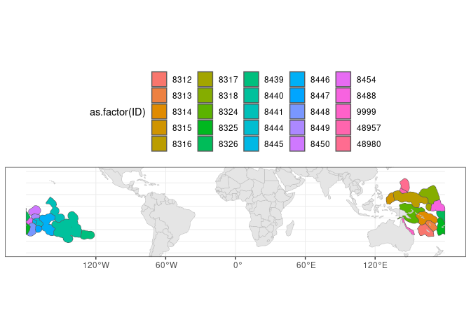

Creating raster mask from shapefile
================
Denisse Fierro Arcos
2023-05-08

- <a href="#introduction" id="toc-introduction">Introduction</a>
- <a href="#loading-r-libraries" id="toc-loading-r-libraries">Loading R
  libraries</a>
- <a href="#loading-eezs-of-the-world-shapefile"
  id="toc-loading-eezs-of-the-world-shapefile">Loading EEZs of the world
  shapefile</a>
- <a href="#loading-list-of-eezs-within-the-south-pacific-region"
  id="toc-loading-list-of-eezs-within-the-south-pacific-region">Loading
  list of EEZs within the South Pacific region</a>
- <a href="#filtering-south-pacific-eezs"
  id="toc-filtering-south-pacific-eezs">Filtering South Pacific EEZs</a>
- <a href="#adding-great-barrier-reef-boundaries"
  id="toc-adding-great-barrier-reef-boundaries">Adding Great Barrier Reef
  Boundaries</a>
  - <a href="#merging-shapefiles" id="toc-merging-shapefiles">Merging
    shapefiles</a>
- <a href="#saving-results" id="toc-saving-results">Saving results</a>
- <a href="#creating-raster-masks" id="toc-creating-raster-masks">Creating
  raster masks</a>
  - <a href="#calculating-grid-cell-area"
    id="toc-calculating-grid-cell-area">Calculating grid cell area</a>
  - <a href="#creating-masked-grid-area-raster"
    id="toc-creating-masked-grid-area-raster">Creating masked grid area
    raster</a>
- <a href="#creating-a-2d-mask-in-csv-format"
  id="toc-creating-a-2d-mask-in-csv-format">Creating a 2D mask in
  <code>csv</code> format</a>
- <a href="#python-based-code"
  id="toc-python-based-code"><code>Python</code>-based code</a>
  - <a href="#loading-libraries" id="toc-loading-libraries">Loading
    libraries</a>
  - <a href="#getting-file-paths-for-area-grid-rasters-and-masks"
    id="toc-getting-file-paths-for-area-grid-rasters-and-masks">Getting file
    paths for area grid rasters and masks</a>
  - <a href="#creating-masked-raster"
    id="toc-creating-masked-raster">Creating masked raster</a>

## Introduction

In this notebook, we will a shapefile from
[VLIZ](https://doi.org/10.14284/386) which contains the boundaries of
all the Exclusive Economic Zones (EEZs) around the world to create a
raster mask for 22 EEZs of our interest. All these EEZ are located
within the South Pacific region and are listed in this
[website](https://stats.pacificdata.org/vis?lc=en&df%5Bds%5D=SPC2&df%5Bid%5D=DF_KEYFACTS&df%5Bag%5D=SPC&df%5Bvs%5D=1.0&dq=..EEZ.&pd=2020%2C2021&ly%5Brw%5D=GEO_PICT).
We will access the South Pacific EEZ list remotely.

The resulting raster mask for the South Pacific EEZs will be used to
extract ISIMIP3B input and output data that will be used to perform
vulnerability assessments of this region. This notebook will use a
combination of `R` and `Python` with the `reticulate` library.

## Loading R libraries

``` r
library(sf)
library(terra)
library(tidyverse)
library(reticulate)
library(jsonlite)
library(rnaturalearth)
library(janitor)
```

## Loading EEZs of the world shapefile

This shapefile was downloaded from [VLIZ](https://doi.org/10.14284/386)
and it is not included in this repository due to its size. Ensure you
have downloaded this file and saved it inside the `Data` folder.

**Note:** The shapefile version 11 downloaded on November 9, 2022 is
used in this notebook. If a later version is available, ensure the file
paths to the shapefile is updated in the code chunk below.

``` r
eez_world <- read_sf("/rd/gem/private/users/ldfierro/World_EEZ_v11_20191118/eez_v11.shp") %>% 
  #We only need a subset of all columns available in the original dataset
  select(MRGID, GEONAME, SOVEREIGN1, SOVEREIGN2, SOVEREIGN3, TERRITORY1, TERRITORY2, TERRITORY3, AREA_KM2)
```

## Loading list of EEZs within the South Pacific region

As mentioned in the introduction, we will only extract data for 22 EEZs
located within the South Pacific region. A list of all relevant EEZs in
this region can be found in the [Pacific Data
Hub](https://pacificdata.org/). We will access this list through an API.

``` r
#Accessing data
SP_EEZ <- fromJSON("https://stats-sdmx-disseminate.pacificdata.org/rest/data/SPC,DF_KEYFACTS,1.0/..EEZ.?startPeriod=2020&endPeriod=2021&dimensionAtObservation=AllDimensions", simplifyDataFrame = T)

#Extracting EEZ list
SP_EEZ <- SP_EEZ$structure$dimensions$observation %>% 
  filter(str_detect(name, "Pacific")) %>% 
  select(values) %>% 
  pull(values) %>% 
  #Converting to data frame
  as.data.frame() %>% 
  #Removing names given in parenthesis before matching to EEZ shapefile
  mutate(name = str_remove(name, " \\(.*\\)"))

head(SP_EEZ)
```

    ##   id                     name
    ## 1 PF         French Polynesia
    ## 2 MP Northern Mariana Islands
    ## 3 WF        Wallis and Futuna
    ## 4 VU                  Vanuatu
    ## 5 PG         Papua New Guinea
    ## 6 PW                    Palau

## Filtering South Pacific EEZs

We will do a `left_join` of the EEZ list above to the `TERRITORY1`
column in our EEZ shapefile. This will extract most of the EEZs of our
interest. This will be followed by a partial match using the `GEONAME`
column for any EEZs missing. We will merge these results into a single
variable.

``` r
#Initial partial match
eez_SP <- SP_EEZ %>% 
  left_join(eez_world, by = join_by("name" == "TERRITORY1"), keep = T)

#Checking missing EEZs from initial match
missing_EEZ <- eez_SP %>% 
  filter(is.na(MRGID)) %>% 
  select(id, name)

missing_EEZ
```

    ##   id     name
    ## 1 KI Kiribati

We will now perform a second partial search using the `GEONAME` column
of the EEZ shapefile, and merge it to our first match results.

``` r
#Performing a partial search and binding results together
eez_SP <-  eez_world %>% 
  filter(str_detect(GEONAME, paste(missing_EEZ$name, collapse = "|"))) %>% 
  #Adding South Pacific EEZ names
  bind_cols(missing_EEZ, .) %>% 
  #Merging to initial results
  bind_rows(eez_SP) %>% 
  #Dropping rows with no results
  drop_na(MRGID) %>% 
  #Turning character columns into factors
  mutate_if(is.character, as.factor) %>% 
  #Converting back to shapefile
  st_as_sf()
  
#Checking all South Pacific EEZs are included in final result
eez_SP$name %in% SP_EEZ$name
```

    ##  [1] TRUE TRUE TRUE TRUE TRUE TRUE TRUE TRUE TRUE TRUE TRUE TRUE TRUE TRUE TRUE
    ## [16] TRUE TRUE TRUE TRUE TRUE TRUE TRUE TRUE TRUE TRUE

``` r
#Deleting unused variable
rm(missing_EEZ, eez_world)
```

We will plot the shapefile to inspect the results.

``` r
#Loading land shapefile to include in plot
land <- ne_countries(type = "countries", returnclass = "sf")

#Plotting FAO shapefile
eez_SP %>% 
  ggplot()+
  geom_sf(aes(fill = name))+
  geom_sf(data = land, inherit.aes = F, color = "gray")+
  theme_bw()+
  theme(legend.position = "none")+
  lims(y = c(-40, 30))
```

<!-- -->

All the EEZs are located within our area of interest, the South Pacific,
we can now save the results.

## Adding Great Barrier Reef Boundaries

Before saving the shapefile, we will add one polygon defining the
boundaries of the Great Barrier Reef (GBR) to our South Pacific EEZs.
This shapefile is included in the `Data` folder.

First, we need to load this shapefile to our environment.

``` r
#Loading shapefile
gbr <- read_sf("../Data/GBR_Outer_Boundary/GBR_outer_boundary.shp") %>% 
  clean_names() %>% 
  #Simplifying shapefile
  st_combine() %>% 
  st_as_sf() %>% 
  rename("geometry" = "x")

#Checking contents - It has a single polygon
gbr
```

    ## Simple feature collection with 1 feature and 0 fields
    ## Geometry type: MULTIPOLYGON
    ## Dimension:     XY
    ## Bounding box:  xmin: 142.5315 ymin: -24.4985 xmax: 154.001 ymax: -10.68189
    ## Geodetic CRS:  WGS 84
    ##                         geometry
    ## 1 MULTIPOLYGON (((152.0794 -2...

### Merging shapefiles

``` r
#Merging shapefiles
gbr_eez_SP <- bind_rows(gbr, eez_SP)

#Checking results
gbr_eez_SP
```

    ## Simple feature collection with 26 features and 11 fields
    ## Geometry type: MULTIPOLYGON
    ## Dimension:     XY
    ## Bounding box:  xmin: -180 ymin: -31.24447 xmax: 180 ymax: 23.89565
    ## Geodetic CRS:  WGS 84
    ## First 10 features:
    ##      id                     name MRGID
    ## 1  <NA>                     <NA>    NA
    ## 2    KI                 Kiribati  8450
    ## 3    KI                 Kiribati  8441
    ## 4    KI                 Kiribati  8488
    ## 5    PF         French Polynesia  8440
    ## 6    MP Northern Mariana Islands 48980
    ## 7    WF        Wallis and Futuna  8454
    ## 8    VU                  Vanuatu  8313
    ## 9    PG         Papua New Guinea 21798
    ## 10   PG         Papua New Guinea  8324
    ##                                                      GEONAME       SOVEREIGN1
    ## 1                                                       <NA>             <NA>
    ## 2         Kiribati Exclusive Economic Zone (Phoenix Islands)         Kiribati
    ## 3            Kiribati Exclusive Economic Zone (Line Islands)         Kiribati
    ## 4         Kiribati Exclusive Economic Zone (Gilbert Islands)         Kiribati
    ## 5                  French Polynesian Exclusive Economic Zone           France
    ## 6                   Northern Mariana Exclusive Economic Zone    United States
    ## 7                  Wallis and Futuna Exclusive Economic Zone           France
    ## 8                            Vanuatu Exclusive Economic Zone          Vanuatu
    ## 9  Protected Zone established under the Torres Strait Treaty Papua New Guinea
    ## 10                 Papua New Guinean Exclusive Economic Zone Papua New Guinea
    ##    SOVEREIGN2 SOVEREIGN3               TERRITORY1 TERRITORY2 TERRITORY3
    ## 1        <NA>       <NA>                     <NA>       <NA>       <NA>
    ## 2        <NA>       <NA>            Phoenix Group       <NA>       <NA>
    ## 3        <NA>       <NA>               Line Group       <NA>       <NA>
    ## 4        <NA>       <NA>          Gilbert Islands       <NA>       <NA>
    ## 5        <NA>       <NA>         French Polynesia       <NA>       <NA>
    ## 6        <NA>       <NA> Northern Mariana Islands       <NA>       <NA>
    ## 7        <NA>       <NA>        Wallis and Futuna       <NA>       <NA>
    ## 8        <NA>       <NA>                  Vanuatu       <NA>       <NA>
    ## 9   Australia       <NA>         Papua New Guinea  Australia       <NA>
    ## 10       <NA>       <NA>         Papua New Guinea       <NA>       <NA>
    ##    AREA_KM2                       geometry
    ## 1        NA MULTIPOLYGON (((152.0794 -2...
    ## 2    745782 MULTIPOLYGON (((-168.9077 -...
    ## 3   1641193 MULTIPOLYGON (((-155.3573 4...
    ## 4   1053245 MULTIPOLYGON (((-179.9966 -...
    ## 5   4766689 MULTIPOLYGON (((-135.9325 -...
    ## 6    763626 MULTIPOLYGON (((148.0771 12...
    ## 7    262750 MULTIPOLYGON (((180 -12.938...
    ## 8    623424 MULTIPOLYGON (((171.6267 -1...
    ## 9      3717 MULTIPOLYGON (((142.8511 -9...
    ## 10  2399638 MULTIPOLYGON (((145 -7.7348...

We will edit the GBR entry, so the name will be more informative. We can
also see above that `Papua New Guinea` (PNG) has two EEZ codes (rows 9
and 10 above). This is because there is a small section of the EEZ that
is shared with Australia under the [Torres Strait Treaty of
1978](https://www.ags.gov.au/legal-briefing-no-116#_ftnref15). Under
this treaty, the shared EEZ between these two countries is designated as
a Protected Zone that allow inhabitants of PNG and the Torres Strait to
move freely to undertake traditional activities, such as traditional
fishing. Given that this and the fact that this project is concerned
with changes in fish biomass, we will consider the entire EEZ to be part
of `Papua New Guinea`, so we will provide a unique ID identifying these
two areas. We will also rename `Kiribati`, so it includes the names of
the subregion under the `name` column.

``` r
gbr_eez_SP <- gbr_eez_SP %>% 
  #Changing GBR name and adding a unique ID
  mutate(name = case_when(is.na(name) ~ "GBR",
                          T ~ name),
         MRGID = case_when(is.na(MRGID) ~ 9999,
                           T ~ MRGID),
         GEONAME = case_when(is.na(GEONAME) ~ "Great Barrier Reef",
                             T ~ GEONAME),
         SOVEREIGN1 = case_when(is.na(SOVEREIGN1) ~ "Australia",
                                T ~ SOVEREIGN1)) %>% 
  #Removing columns that are not needed
  remove_empty("cols") %>% 
  #We will give give the small MRGID value to all polygons as an ID
  group_by(name) %>% 
  #Given same ID to two EEZs in Papua New Guinea
  mutate(ID = case_when(str_detect(name, "Papua") ~ min(MRGID),
                        T ~ MRGID),
         #Including subregion name in Kiribati EEZs
         name = case_when(name == "Kiribati" ~ paste(name, TERRITORY1, sep = " - "),
                          name == "Micronesia" ~ paste0(name, " (FSM)"),
                          T ~ name)) |> 
  ungroup()

#Checking results
gbr_eez_SP
```

    ## Simple feature collection with 26 features and 10 fields
    ## Geometry type: MULTIPOLYGON
    ## Dimension:     XY
    ## Bounding box:  xmin: -180 ymin: -31.24447 xmax: 180 ymax: 23.89565
    ## Geodetic CRS:  WGS 84
    ## # A tibble: 26 × 11
    ##    id    name          MRGID GEONAME SOVEREIGN1 SOVEREIGN2 TERRITORY1 TERRITORY2
    ##    <fct> <chr>         <dbl> <chr>   <chr>      <fct>      <fct>      <fct>     
    ##  1 <NA>  GBR            9999 Great … Australia  <NA>       <NA>       <NA>      
    ##  2 KI    Kiribati - P…  8450 Kiriba… Kiribati   <NA>       Phoenix G… <NA>      
    ##  3 KI    Kiribati - L…  8441 Kiriba… Kiribati   <NA>       Line Group <NA>      
    ##  4 KI    Kiribati - G…  8488 Kiriba… Kiribati   <NA>       Gilbert I… <NA>      
    ##  5 PF    French Polyn…  8440 French… France     <NA>       French Po… <NA>      
    ##  6 MP    Northern Mar… 48980 Northe… United St… <NA>       Northern … <NA>      
    ##  7 WF    Wallis and F…  8454 Wallis… France     <NA>       Wallis an… <NA>      
    ##  8 VU    Vanuatu        8313 Vanuat… Vanuatu    <NA>       Vanuatu    <NA>      
    ##  9 PG    Papua New Gu… 21798 Protec… Papua New… Australia  Papua New… Australia 
    ## 10 PG    Papua New Gu…  8324 Papua … Papua New… <NA>       Papua New… <NA>      
    ## # ℹ 16 more rows
    ## # ℹ 3 more variables: AREA_KM2 <dbl>, geometry <MULTIPOLYGON [°]>, ID <dbl>

We will plot the shapefile to inspect the results.

``` r
#Plotting FAO shapefile
gbr_eez_SP %>% 
  ggplot()+
  geom_sf(aes(fill = as.factor(ID)))+
  geom_sf(data = land, inherit.aes = F, color = "gray")+
  theme_bw()+
  theme(legend.position = "top")+
  lims(y = c(-40, 30))
```

<!-- -->

The map now looks as we expected, so we can save the results into memory
for using in mapping.

## Saving results

We will extract the names and unique IDs for the EEZs and GBR before we
move onto creating the raster masks.

``` r
#Identify EEZ and countries associated with them from extracted data files
SP_codes <- gbr_eez_SP %>% 
  select(name, ID, MRGID) %>% 
  st_drop_geometry()

#Saving results
SP_codes %>% 
  write_csv("../Outputs/SouthPacific_EEZ-GBR_keys.csv")
```

We will save the shapefile with the South Pacific EEZs.

``` r
gbr_eez_SP %>% 
  #We will also allow shapefile to be rewritten
  st_write("../Outputs/SouthPacific_EEZ-GBR.shp", delete_layer = T)
```

## Creating raster masks

We will need to create a raster mask for each unique grid. In this case,
IPSL and GFDL share the same 60 arc minute ($1^\circ$) grid, but IPSL
inputs are also available at a 120 arc minute ($2^{\circ}$) resolution.
This means that we will need to create two different masks.

Since none of the polygons included in our South Pacific EEZ/GBR
shapefile overlap, we can create a 2-dimensional mask, which would speed
up data extractions. Finally, since data extractions need to be
multiplied by the area of each grid cell, our masks will include the
area of each grid cell.

### Calculating grid cell area

The `raster` package allows us to calculate the area of grid cells in
$km^2$ in just one line of code. We can save this to calculate weighted
means by area. We will use the raster above as a base, and we will save
the result on our disk.

We will define a function that will automate the grid cell area
calculation, and save the result.

``` r
#Input description
#raster_path is the full file path to the sample grid
#folder_out_path is the path to the folder where area masks will be saved
raster_area <- function(raster_path, folder_out_path){
  #Extracting model name and resolution
  model_name <- str_extract(raster_path, "grid//(.*)_r", group = 1)
  res <- str_extract(raster_path, "_(\\d{2,3}arcmin)_", group = 1)
  #Writing file name for mask
  file_out <- paste0(paste("grid-area", model_name, res, sep = "_"), ".nc")
  
  #Loading raster
  ras <- rast(raster_path)
  
  #Calculating area
  area_grid <- cellSize(ras, unit = "km")
  
  #Saving results
  writeCDF(area_grid, file.path(folder_out_path, file_out), overwrite = T, 
            #We will save the variable names so they match the Fish-MIP models
            varname = "area", unit = "km2")
}
```

We will now apply the function to all grids.

``` r
#Getting full file paths for all sample rasters
raster_files <- list.files("../Data/Model_sample_grid/", full.names = T)

#Applying function to all rasters
raster_files %>% 
  map(\(x) raster_area(x, folder_out_path ="../Outputs"))
```

### Creating masked grid area raster

We will now mask the grid cell area raster using the shapefile we
created above. First, we define a function to mask rasters.

``` r
raster_mask <- function(raster_path, shp, ID, folder_out_path){
  #Extracting model name and resolution
  model_name <- str_extract(raster_path, "area_(.*)_\\d{2,3}", group = 1)
  res <- str_extract(raster_path, "_(\\d{2,3}arcmin).", group = 1)
  #Writing file name for mask
  file_out <- paste0(paste("mask", model_name, res, sep = "_"), ".nc")
  
  #Loading raster
  ras <- rast(raster_path)
  
  #Calculating area
  area_grid <- rasterize(shp, ras, field = ID, touches = T, fun = "min")
  
  #Saving results
  writeCDF(area_grid, file.path(folder_out_path, file_out), overwrite = T, 
            #We will save the variable names so they match the Fish-MIP models
            varname = "mask", unit = "km2")
}
```

Now we apply this function to all grid area rasters on disk.

``` r
#Getting list of grid area rasters
area_grid <- list.files("../Outputs", pattern = "^grid.*nc$", full.names = T)

#Applying masking function
area_grid %>% 
  map(\(x) raster_mask(x, gbr_eez_SP, gbr_eez_SP$ID, folder_out_path ="../Outputs"))
```

## Creating a 2D mask in `csv` format

Depending on the format of your data, it may be better to have a 2D mask
in `csv` format. We can create one using the raster we created in the
previous step. We will switch to `R` to complete this step.

``` r
#Turning rasters into CSV
raster_to_csv <- function(raster_path){
  #Load raster
  ras <- rast(raster_path)
  
  #We will now convert our stack into points
  ras_df <- ras %>% 
  #Transforming form matrix to data frame
  as.data.frame(xy = T) %>% 
  #Renaming latitude and longitude column
  rename("Lon" = "x", "Lat" = "y") 
  
  #Creating name for csv file
  file_out <- str_replace(raster_path, ".nc", ".csv")
  
  #Saving the end file in your local machine
  write_csv(ras_df, file_out)
}
```

Applying function to all raster masks.

``` r
#Getting list of mask rasters
mask_files <- list.files("../Outputs", pattern = "^mask_.*nc$", full.names = T)

#Applying csv function
mask_files %>% 
  map(\(x) raster_to_csv(x))
```

The final step is to merge these two files together. We will do this in
`Python`.

# `Python`-based code

``` r
#Activating conda
repl_python()
```

## Loading libraries

``` python
import xarray as xr
from glob import glob
import os
import re
```

## Getting file paths for area grid rasters and masks

``` python
#Rasters for grid area
area_grid = sorted(glob('../Outputs/grid-area*.nc'))

#Raster with mask
mask_grid = sorted(glob('../Outputs/mask_*arcmin*.nc'))
```

## Creating masked raster

Creating function to mask grid area raster.

``` python
def mask_raster(area_path, mask_path):
  #Creating name for new raster
  fp = re.split("/", area_path)
  file_out = os.path.join(fp[0], fp[1], f'masked-{fp[2]}')
  
  #Loading mask and area rasters
  area = xr.open_dataset(area_path).area
  mask = xr.open_dataset(mask_path).mask
  
  #Adding mask as coordinate
  area.coords['mask'] = (('latitude', 'longitude'), mask.values)
  area.to_netcdf(file_out)
```

Applying function to all grid area rasters.

``` python
[mask_raster(a, mask_grid[i]) for i, a in enumerate(area_grid)]
```
