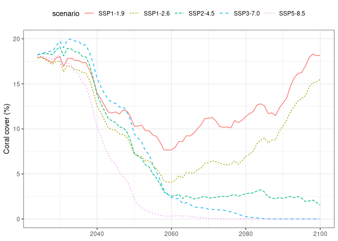

Biomass projections for Pacific Islands Countries and Territories
(PICTs)
================
Beth Fulton and Denisse Fierro Arcos
2023-11-29

- <a
  href="#generating-biomass-projections-for-pacific-islands-countries-and-territories-picts"
  id="toc-generating-biomass-projections-for-pacific-islands-countries-and-territories-picts">Generating
  biomass projections for Pacific Islands Countries and Territories
  (PICTs)</a>
  - <a href="#loading-relevant-libraries"
    id="toc-loading-relevant-libraries">Loading relevant libraries</a>
  - <a
    href="#listing-files-containing-past-and-future-fish-biomass-estimates"
    id="toc-listing-files-containing-past-and-future-fish-biomass-estimates">Listing
    files containing past and future fish biomass estimates</a>
  - <a href="#steps-in-generating-biomass-projections-for-picts"
    id="toc-steps-in-generating-biomass-projections-for-picts">Steps in
    generating biomass projections for PICTs</a>
  - <a href="#1-biomass-projections-from-reefmod-data"
    id="toc-1-biomass-projections-from-reefmod-data">1. Biomass projections
    from REEFMOD data</a>
    - <a href="#relationships-between-coral-cover-and-fish-biomass"
      id="toc-relationships-between-coral-cover-and-fish-biomass">Relationships
      between coral cover and fish biomass</a>
  - <a href="#2-biomass-projections-from-fish-mip-models"
    id="toc-2-biomass-projections-from-fish-mip-models">2. Biomass
    projections from Fish-MIP models</a>
    - <a href="#loading-projected-biomass-data"
      id="toc-loading-projected-biomass-data">Loading projected biomass
      data</a>
    - <a href="#calculating-yearly-biomass-for-all-models"
      id="toc-calculating-yearly-biomass-for-all-models">Calculating yearly
      biomass for all models</a>
    - <a href="#calculating-biomass-ensemble-statistics"
      id="toc-calculating-biomass-ensemble-statistics">Calculating biomass
      ensemble statistics</a>
  - <a href="#3-comparing-fish-mip-and-reefmod-biomass-estimates"
    id="toc-3-comparing-fish-mip-and-reefmod-biomass-estimates">3. Comparing
    Fish-MIP and REEFMOD biomass estimates</a>
  - <a href="#4-calculating-proportion-of-demersal-biomass"
    id="toc-4-calculating-proportion-of-demersal-biomass">4. Calculating
    proportion of demersal biomass</a>
  - <a href="#5-bias-correcting-fish-mip-ensemble-biomass-projections"
    id="toc-5-bias-correcting-fish-mip-ensemble-biomass-projections">5. Bias
    correcting Fish-MIP ensemble biomass projections</a>

# Generating biomass projections for Pacific Islands Countries and Territories (PICTs)

The workflow described in this notebook was developed by [Dr Beth
Fulton](https://orcid.org/0000-0002-5904-7917) (CSIRO) and implemented
in `R` by [Denisse Fierro Arcos](https://github.com/lidefi87/). The text
describing the methods was largely written by Dr Fulton with minor edits
by Denisse.

This notebook implements in `R` the workflow designed to generate
demersal fish (and invertebrate) biomass projections for the Pacific
Islands Countries and Territories (PICTs) to the year 2100. This
workflow uses relationships observed in coral reefs between coral cover
and fish biomass, as well as projections of coral cover in the Great
Barrier Reef and fish biomass in the Pacific from the [Fisheries and
Marine Ecosystem Model Intercomparison Project
(Fish-MIP)](https://fish-mip.github.io/).

## Loading relevant libraries

``` r
library(tidyverse)
library(openxlsx)
library(sf)
library(janitor)
library(units)
library(knitr)
```

## Listing files containing past and future fish biomass estimates

``` r
# #Folder containing outputs from fisheries models
# base_folder <- "/rd/gem/public/fishmip/PICTs/EEZ_Summaries_bio_10g_10kg/EEZsummaries"
# #Listing all relevant files to calculate biomass projections
# global_files <- list.files(base_folder, pattern =  "global.csv", full.names = T)

#Base spreadsheet
working_data <- "../Analysis/Excel Sheets/bias_correction_calculations_mean_coral_cover_all_climate_scenarios.xlsx"
```

## Steps in generating biomass projections for PICTs

To generate biomass projections for PICTs, we used biomass estimates
produced by six different fisheries models:  
1. [APECOSM](https://apecosm.org/) - Apex Predators ECOSystem Model,
which represents the spatialized dynamics of open ocean pelagic
ecosystems in the global ocean.  
2. [BOATS](https://earthsystemdynamics.org/models/boats/) - BiOeconomic
mArine Trophic Size-spectrum model simulates the global fishery as a
coupled ecological-economic system.  
3.
[DBPM](https://github.com/Benthic-Pelagic-Size-Spectrum-Model/dbpm_isimip_2) -
The Dynamic Benthic Pelagic Model is a dynamic size spectrum model for
modelling the coupling “pelagic” size-based predators and “benthic”
detritivores that share a unstructured resource pool (detritus).  
4. [EcoTroph](https://doi.org/10.1016/j.ecolmodel.2009.07.031) -
EcoTroph models the functioning of marine ecosystems as flows of biomass
from low to high trophic levels, so as to quantify easily the impacts of
fishing at an ecosystem scale.  
5. [Macroecological](https://doi.org/10.1371/journal.pone.0133794) -
Macroecological is a static equilibrium model, which uses ecological and
metabolic scaling theory to predict mean size composition and abundance
of animals (including fish).  
6. [ZooMSS](https://doi.org/10.1016/j.ecolmodel.2020.109265) - The
Zooplankton Model of Size Spectra is a functional size-spectrum model of
the marine ecosystem to resolve phytoplankton, nine zooplankton
functional groups (heterotrophic flagellates and ciliates, omnivorous
and carnivorous copepods, larvaceans, euphausiids, salps, chaetognaths
and jellyfish) and three size-based fish groups.

## 1. Biomass projections from REEFMOD data

A relationship between coral cover and fish biomass has been established
in the literature. A quick synthesis of existing relationships can be
found in the document `Relationships for fish biomass model.docx`.

### Relationships between coral cover and fish biomass

The most useful relationships came from the [Graham and Nash
(2013)](https://doi.org/10.1007/s00338-012-0984-y) data set (explored in
`graham_nash_2012_dataset.xlsx`). Using the raw data gives the following
relationships:

**Equation 1**: Structural complexity as a function of coral cover.
($r^2$ = 0.4314)  
$struct_{complexity} = 3e^{-7} \times {coral_{cover}}^4 - 5e^{-5} \times {coral_{cover}}^3 + 0.0022 \times {coral_{cover}}^2 + 1.3892$

``` r
#Loading coral cover data
coral <- read.xlsx(working_data, sheet = 1)

#Calculating structural complexity using equation 1 above
coral <- coral |> 
  #rearrange data to facilitate calculations
  pivot_longer(-Year, names_to = "scenario", values_to = "coral_cover") |> 
  #make names small case
  clean_names() |> 
  #calculate structural complexity
  mutate(struct_complex = (3e-7*(coral_cover^4))-((5e-5)*(coral_cover^3))+(0.0022*(coral_cover^2))+1.3892)

#Checking results
head(coral)
```

    ## # A tibble: 6 × 4
    ##    year scenario coral_cover struct_complex
    ##   <dbl> <chr>          <dbl>          <dbl>
    ## 1  2024 SSP1-1.9        17.9           1.84
    ## 2  2024 SSP1-2.6        17.9           1.84
    ## 3  2024 SSP2-4.5        18.2           1.85
    ## 4  2024 SSP3-7.0        18.2           1.85
    ## 5  2024 SSP5-8.5        18.0           1.84
    ## 6  2025 SSP1-1.9        18.0           1.84

``` r
#Visualising data
coral |> 
  ggplot(aes(x = year, y = coral_cover, colour = scenario, linetype = scenario))+
  geom_line()+
  theme_bw()+
  labs(y = "Coral cover (%)")+
  theme(axis.title.x = element_blank(), 
        legend.position = "top", legend.direction = "horizontal")
```

<!-- -->

**Equation 2**: Fish biomass ($kg \times ha^{-1}$) as a function of
structural complexity ($r^2$ = 0.6102). Note that a logistic is a little
poorer fit, so using a quadratic on the argument that once a reef
habitat is too complex, it loses places for fish to sit.  
$fish_{biomass} = -2294.6 \times {struct_{complexity}}^2 + 8961.1 \times struct_{complexity} - 6843.6$

``` r
#Calculating fish biomass
coral <- coral |> 
  mutate(fish_biomass = (-2294.6*(struct_complex^2))+(8961.1*struct_complex)-6843.6)

#Checking results
head(coral)
```

    ## # A tibble: 6 × 5
    ##    year scenario coral_cover struct_complex fish_biomass
    ##   <dbl> <chr>          <dbl>          <dbl>        <dbl>
    ## 1  2024 SSP1-1.9        17.9           1.84        1875.
    ## 2  2024 SSP1-2.6        17.9           1.84        1875.
    ## 3  2024 SSP2-4.5        18.2           1.85        1881.
    ## 4  2024 SSP3-7.0        18.2           1.85        1881.
    ## 5  2024 SSP5-8.5        18.0           1.84        1878.
    ## 6  2025 SSP1-1.9        18.0           1.84        1877.

The REEF_MOD project (of Yves-Marie Bozec and Peter Mumby at University
of Queensland) has postulated a slightly different set of relationships
from the same data (basically a linear relationship).

Fitting a line to the lower, median and upper bounds of this
relationship gives the following equations:

**Equation 3**: REEFMOD lower bound equation:
$fish_{biomass} = 12.716 \times coral_{cover} + 146.75$  
**Equation 4**: REEFMOD median equation:
$fish_{biomass} = 13.56 \times coral_{cover} + 732.15$ **Equation 5**:
REEFMOD upper bound equation:
$fish_{biomass} = 14.285 \times coral_{cover} + 1325.7$

``` r
#Calculating REEFMOD biomass values
coral <- coral |> 
  #lower biomass bound
  mutate(reefmod_lower_biomass = 12.716*coral_cover+146.75,
         #median biomass
         reefmod_median_biomass = 13.56*coral_cover+732.15,
         #upper biomass bound
         reefmod_upper_biomass = 14.285*coral_cover+1325.7)

head(coral)
```

    ## # A tibble: 6 × 8
    ##    year scenario coral_cover struct_complex fish_biomass reefmod_lower_biomass
    ##   <dbl> <chr>          <dbl>          <dbl>        <dbl>                 <dbl>
    ## 1  2024 SSP1-1.9        17.9           1.84        1875.                  374.
    ## 2  2024 SSP1-2.6        17.9           1.84        1875.                  374.
    ## 3  2024 SSP2-4.5        18.2           1.85        1881.                  378.
    ## 4  2024 SSP3-7.0        18.2           1.85        1881.                  379.
    ## 5  2024 SSP5-8.5        18.0           1.84        1878.                  376.
    ## 6  2025 SSP1-1.9        18.0           1.84        1877.                  376.
    ## # ℹ 2 more variables: reefmod_median_biomass <dbl>, reefmod_upper_biomass <dbl>

Note that the REEFMOD team predicted mean coral coverage from 2024 to
2100 for the Great Barrier Reef (GBR) under five emissions scenarios:
SSP1-1.9, SSP1-2.6, SSP2-4.5, SSP3-7.0, and SSP5-8.5. The above
calculations were applied to these five projections.

## 2. Biomass projections from Fish-MIP models

Monthly projected biomass for the GBR under scenarios SSP1-2.6 and
SSP5-8.5 were extracted from Fish-MIP global models using a polygon.
Annual time series were calculated for Fish-MIP models forced by both
GFDL and IPSL general circulation models.

Projections from DBEM were removed from further analysis because biomass
values were 100x lower than all other models. Similarly, biomass values
projected by Ecotroph forced by GFDL were removed as those values were
an order of magnitude higher than all other models.

Biomass projections from all other models were used to calculate a
biomass ensemble minimum, mean and maximum from 2024 to 2100.

### Loading projected biomass data

``` r
#Load monthly biomass
bio_data_all_models <- read.xlsx(working_data, sheet = "vsFISHMIP All TimeSteps", startRow = 2, detectDates = T)

#We will divide this scenario
scenarios <- which(str_detect(names(bio_data_all_models), "SSP"))

#Creating empty data frame to save results
bio_data <- data.frame()
#Create new longer data frame - Split at each scenario
for(i in 1:length(scenarios)){
  #Find the column with scenario name
  start <- scenarios[i]
  #End in the column before next scenario
  end <- scenarios[i+1]-1
  #If it is the last scenario, select everything until the end
  if(is.na(end)){
    end <- ncol(bio_data_all_models)
  }
  #Get scenario name
  ssp <- names(bio_data_all_models)[start]
  #Extract data between start and end columns
  da <- bio_data_all_models[,(start+1):end] |> 
    #Reshaping data
    pivot_longer(!Year, names_to = "fish_model", values_to = "proj_biomass") |> 
    #Add scenario
    mutate(scenario = ssp,
           #Get year from date
           year = year(Year),
           #Get month from date
           month = month(Year)) |> 
    #Remove date (incorrectly labelled as Year)
    select(!Year) |> 
    #Remove data before 2024
    filter(year >= 2024) |> 
    #Remove DBEM models and EcoTroph forced by GFDL
    filter(str_detect(fish_model, "DBEM", negate = T) & fish_model != "EcoTroph_GFDL")
  #Putting everything together in new data frame
  bio_data <- bio_data |> 
    bind_rows(da)
}

#Checking results
head(bio_data)
```

    ##      fish_model proj_biomass scenario year month
    ## 1  APECOSM_IPSL     517022.9 SSP1-2.6 2024     1
    ## 2    BOATS_GDFL     835567.9 SSP1-2.6 2024     1
    ## 3    BOATS_IPSL     309913.0 SSP1-2.6 2024     1
    ## 4     DBPM_IPSL    2088809.4 SSP1-2.6 2024     1
    ## 5 EcoOcean_GFDL    5617553.5 SSP1-2.6 2024     1
    ## 6 EcoOcean_IPSL    3344991.5 SSP1-2.6 2024     1

Some models only have yearly biomass outputs available. We will identify
these from the dataset and extract them from the spreadsheet.

``` r
#Identifying models for which there is no monthly data
yearly_models <- bio_data |> 
  filter(is.na(proj_biomass)) |> 
  #Removing EcoOcean because there is no yearly data available
  filter(str_detect(fish_model, "EcoOcean", negate = T)) |> 
  distinct(fish_model) |> 
  pull()

#Loading yearly biomass
bio_yearly <- read.xlsx(working_data, sheet = "vsFISHMIP_Annual_tonnes", startRow = 2)

#We will divide this scenario
scenarios <- which(str_detect(names(bio_yearly), "SSP"))

#Creating empty data frame to save results
bio_year <- data.frame()
#Create new longer data frame - Split at each scenario
for(i in 1:length(scenarios)){
  #Find the column with scenario name
  start <- scenarios[i]
  #End in the column before next scenario
  end <- scenarios[i+1]-1
  #If it is the last scenario, select everything until the end
  if(is.na(end)){
    end <- ncol(bio_yearly)
  }
  #Get scenario name
  ssp <- names(bio_yearly)[start]
  #Extract data between start and end columns
  da <- bio_yearly[,(start+1):end] |> 
    #Reshaping data
    pivot_longer(!Year, names_to = "fish_model", values_to = "annual_biomass") |> 
    #Add scenario
    mutate(scenario = ssp) |> 
    #Rename year so it matches monthly data
    rename(year = Year) |> 
    #Remove data before 2024
    filter(year >= 2024) |> 
    #Extract only biomass values from models for which there is no monthly data
    filter(fish_model %in% yearly_models) |> 
    #Reorder columns to match monthly data
    select(scenario, fish_model, year, annual_biomass)
  #Putting everything together in new data frame
  bio_year <- bio_year |> 
    bind_rows(da)
}

#Removing models without data
bio_year <- bio_year |> 
  drop_na(annual_biomass)

#Check results
head(bio_year)
```

    ##   scenario           fish_model year annual_biomass
    ## 1 SSP1-2.6       EcoTroph_IPSLL 2024      1372791.2
    ## 2 SSP1-2.6 MACROECOLOGICAL_GFDL 2024      1850575.2
    ## 3 SSP1-2.6 MACROECOLOGICAL_IPSL 2024       617784.6
    ## 4 SSP1-2.6       EcoTroph_IPSLL 2025      2053356.5
    ## 5 SSP1-2.6 MACROECOLOGICAL_GFDL 2025      1877785.8
    ## 6 SSP1-2.6 MACROECOLOGICAL_IPSL 2025       840855.1

### Calculating yearly biomass for all models

Here we add all biomass values per model, per year, and per scenario.

``` r
#Yearly biomass calculations
bio_data <- bio_data |> 
  #Remove models with no data
  drop_na(proj_biomass) |>
  #Calculate biomass sum by year, model and scenario
  group_by(scenario, fish_model, year) |> 
  summarise(annual_biomass = sum(proj_biomass, na.rm = T)) |> 
  #Add yearly values imported above
  bind_rows(bio_year)
```

    ## `summarise()` has grouped output by 'scenario', 'fish_model'. You can override
    ## using the `.groups` argument.

``` r
#Extracting demersal and pelagic biomass from FEISTY and DBPM models to be later
dem_pel_bio <- bio_data |> 
    filter(str_detect(fish_model, "_DEM|_PELAG"))

#Removing models ending in _DEM or _PELAG because they are not used in calculations
bio_data <- bio_data |> 
    filter(!str_detect(fish_model, "_DEM|_PELAG"))

#We need to calculate the area for the GBR. We will use the GBR shapefile to calculate this
gbr_area <- read_sf("../Data/GBR_Outer_Boundary/GBR_outer_boundary.shp") |> 
  st_area()
#The area is given as m^2, but we need it in hectares
units(gbr_area) <- make_units(ha)

#Convert biomass units from tonnes to kg/ha
bio_data <- bio_data |> 
  mutate(biomass_kg_ha = annual_biomass*1000/as.numeric(gbr_area))

#Check results
head(bio_data)
```

    ## # A tibble: 6 × 5
    ## # Groups:   scenario, fish_model [1]
    ##   scenario fish_model    year annual_biomass biomass_kg_ha
    ##   <chr>    <chr>        <dbl>          <dbl>         <dbl>
    ## 1 SSP1-2.6 APECOSM_IPSL  2024       6096594.          176.
    ## 2 SSP1-2.6 APECOSM_IPSL  2025       6483495.          188.
    ## 3 SSP1-2.6 APECOSM_IPSL  2026       7531970.          218.
    ## 4 SSP1-2.6 APECOSM_IPSL  2027       7349169.          213.
    ## 5 SSP1-2.6 APECOSM_IPSL  2028       7711895.          223.
    ## 6 SSP1-2.6 APECOSM_IPSL  2029       7546462.          218.

### Calculating biomass ensemble statistics

We will calculate minimum, mean and maximum biomass for the entire
ensemble between 2024 and 2100.

``` r
#Calculating ensemble statistics
bio_data <- bio_data |> 
  group_by(scenario, year) |> 
  summarise(fishmip_lower_bio = min(biomass_kg_ha, na.rm = T),
            fishmip_mean_bio = mean(biomass_kg_ha, na.rm = T),
            fishmip_upper_bio = max(biomass_kg_ha, na.rm = T))
```

    ## `summarise()` has grouped output by 'scenario'. You can override using the
    ## `.groups` argument.

``` r
#Checking results
head(bio_data)
```

    ## # A tibble: 6 × 5
    ## # Groups:   scenario [1]
    ##   scenario  year fishmip_lower_bio fishmip_mean_bio fishmip_upper_bio
    ##   <chr>    <dbl>             <dbl>            <dbl>             <dbl>
    ## 1 SSP1-2.6  2024              17.9             461.             1980.
    ## 2 SSP1-2.6  2025              24.3             477.             2021.
    ## 3 SSP1-2.6  2026              20.8             470.             1985.
    ## 4 SSP1-2.6  2027              24.0             466.             1989.
    ## 5 SSP1-2.6  2028              26.9             472.             1955.
    ## 6 SSP1-2.6  2029              26.4             476.             1994.

## 3. Comparing Fish-MIP and REEFMOD biomass estimates

For scenarios SSP1-2.6 and SSP5-8.5, we will compare the biomass
estimates calculated from REEFMOD data (step 1) and the Fish-MIP model
ensemble (step 2). We will divide the ensemble mean by the biomass
estimates obtained from equation 2 (`fish_biomass` column in `coral`
data frame), and by the median, upper, lower bounds obtained from
REEFMOD data (equations 3 to 5). This calculations will help us estimate
the bias of the Fish-MIP global model ensemble.

``` r
fishmip_biases <- bio_data |> 
  #Adding REEFMOD biomass estimates
  left_join(coral, by = c("scenario", "year")) |> 
  #Removing coral data that is not needed
  select(!c(coral_cover, struct_complex)) |> 
  #Calculating Fish-MIP ensemble biases
  mutate(mean_bias_fish_bio_fishmip = fish_biomass/fishmip_mean_bio,
         lower_bias_reefmod_fishmip = reefmod_lower_biomass/fishmip_lower_bio,
         mean_bias_reefmod_fishmip = reefmod_median_biomass/fishmip_mean_bio,
         upper_bias_reefmod_fishmip = reefmod_upper_biomass/fishmip_upper_bio)
  
#Check results
head(fishmip_biases)
```

    ## # A tibble: 6 × 13
    ## # Groups:   scenario [1]
    ##   scenario  year fishmip_lower_bio fishmip_mean_bio fishmip_upper_bio
    ##   <chr>    <dbl>             <dbl>            <dbl>             <dbl>
    ## 1 SSP1-2.6  2024              17.9             461.             1980.
    ## 2 SSP1-2.6  2025              24.3             477.             2021.
    ## 3 SSP1-2.6  2026              20.8             470.             1985.
    ## 4 SSP1-2.6  2027              24.0             466.             1989.
    ## 5 SSP1-2.6  2028              26.9             472.             1955.
    ## 6 SSP1-2.6  2029              26.4             476.             1994.
    ## # ℹ 8 more variables: fish_biomass <dbl>, reefmod_lower_biomass <dbl>,
    ## #   reefmod_median_biomass <dbl>, reefmod_upper_biomass <dbl>,
    ## #   mean_bias_fish_bio_fishmip <dbl>, lower_bias_reefmod_fishmip <dbl>,
    ## #   mean_bias_reefmod_fishmip <dbl>, upper_bias_reefmod_fishmip <dbl>

## 4. Calculating proportion of demersal biomass

Two Fish-MIP models provide demersal and pelagic biomass estimates:
FEISTY (forced by GFDL model) and DBPM (forced by IPSL model). We will
use this information to calculate the ratio of the demersal component
from the total consumer biomass (demersal + pelagic biomass).

``` r
dem_prop <- dem_pel_bio |> 
  #Remove FEISTY IPSL because it is not needed in this calculation
  filter(str_detect(fish_model, "FEISTY_IPSL", negate = T)) |> 
  #Adding column with biomass type
  mutate(bio_type = str_split_i(fish_model, "_", i = -1),
         fish_model = str_remove(fish_model, "_DEM|_PELAG")) |> 
  #Rearranging table to calculate demersal biomass proportions
  pivot_wider(names_from = bio_type, values_from = annual_biomass) |> 
  #Calculating proportion
  mutate(prop_dem = DEM/(DEM+PELAG))

#Checking result
head(dem_prop)
```

    ## # A tibble: 6 × 6
    ## # Groups:   scenario, fish_model [1]
    ##   scenario fish_model  year       DEM    PELAG prop_dem
    ##   <chr>    <chr>      <dbl>     <dbl>    <dbl>    <dbl>
    ## 1 SSP1-2.6 DBPM_IPSL   2024 21925372. 3286272.    0.870
    ## 2 SSP1-2.6 DBPM_IPSL   2025 22758797. 3282367.    0.874
    ## 3 SSP1-2.6 DBPM_IPSL   2026 22450655. 3280010.    0.873
    ## 4 SSP1-2.6 DBPM_IPSL   2027 22487994. 3276805.    0.873
    ## 5 SSP1-2.6 DBPM_IPSL   2028 22777626. 3310580.    0.873
    ## 6 SSP1-2.6 DBPM_IPSL   2029 21944861. 3359580.    0.867

## 5. Bias correcting Fish-MIP ensemble biomass projections

The bias estimates and demersal proportions calculated above will be
used into calculate the biomass per hectare for each PICT for two
scenarios: `SSP1-2.6` and `SSP5-8.5`. Biomass estimates from Fish-MIP
global models were extracted using the EEZ boundaries of each PICT. This
information was used to calculate the minimum, mean and maximum biomass
estimates for the entire ensemble. Note that the same models excluded in
step 3 are also excluded here. Finally, a set of bias corrected time
series are then generated based on the following combinations:

| vs            | bias_based_on_Nash       | bias_based_on_min  | bias_based_on_mean    | bias_based_on_max  |
|:--------------|:-------------------------|:-------------------|:----------------------|:-------------------|
| Emsemble min  | Biomass estimates (eq 2) | REEFMOD min (eq 3) | REEFMOD median (eq 4) | REEFMOD max (eq 5) |
| Emsemble mean | Biomass estimates (eq 2) | REEFMOD min (eq 3) | REEFMOD median (eq 4) | REEFMOD max (eq 5) |
| Emsemble max  | Biomass estimates (eq 2) | REEFMOD min (eq 3) | REEFMOD median (eq 4) | REEFMOD max (eq 5) |

In each case the biomass is given as:

$biomass_{est} = ensemble_{biomass} \times bias_{correction}$
