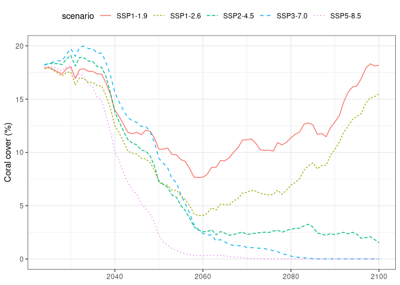
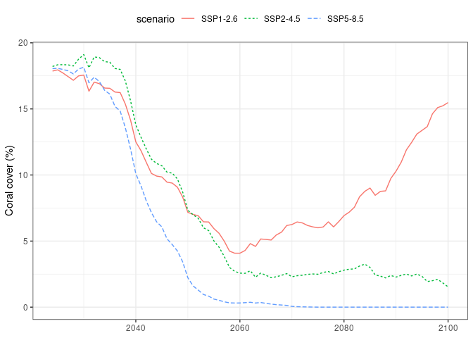

Biomass projections for Pacific Islands Countries and Territories
(PICTs)
================
Beth Fulton and Denisse Fierro Arcos
2023-11-29

- <a
  href="#generating-biomass-projections-for-pacific-islands-countries-and-territories-picts"
  id="toc-generating-biomass-projections-for-pacific-islands-countries-and-territories-picts">Generating
  biomass projections for Pacific Islands Countries and Territories
  (PICTs)</a>
  - <a href="#loading-relevant-libraries"
    id="toc-loading-relevant-libraries">Loading relevant libraries</a>
  - <a
    href="#fish-mip-models-used-to-generate-biomass-projections-for-picts"
    id="toc-fish-mip-models-used-to-generate-biomass-projections-for-picts">Fish-MIP
    models used to generate biomass projections for PICTs</a>
  - <a href="#1-biomass-projections-from-reefmod-data"
    id="toc-1-biomass-projections-from-reefmod-data">1. Biomass projections
    from REEFMOD data</a>
    - <a href="#relationships-between-coral-cover-and-fish-biomass"
      id="toc-relationships-between-coral-cover-and-fish-biomass">Relationships
      between coral cover and fish biomass</a>
  - <a href="#2-biomass-projections-from-fish-mip-models"
    id="toc-2-biomass-projections-from-fish-mip-models">2. Biomass
    projections from Fish-MIP models</a>
    - <a href="#extracting-biomass-data-for-the-gbr"
      id="toc-extracting-biomass-data-for-the-gbr">Extracting biomass data for
      the GBR</a>
    - <a href="#calculating-biomass-ensemble-statistics"
      id="toc-calculating-biomass-ensemble-statistics">Calculating biomass
      ensemble statistics</a>
  - <a href="#3-estimating-biases-from-fishmip-model-ensemble"
    id="toc-3-estimating-biases-from-fishmip-model-ensemble">3. Estimating
    biases from FishMIP model ensemble</a>
  - <a href="#4-calculating-proportion-of-demersal-biomass-optional-step"
    id="toc-4-calculating-proportion-of-demersal-biomass-optional-step">4.
    Calculating proportion of demersal biomass (<em>optional step</em>)</a>
  - <a
    href="#5-bias-corrected-biomass-projections-calculated-from-fish-mip-ensemble"
    id="toc-5-bias-corrected-biomass-projections-calculated-from-fish-mip-ensemble">5.
    Bias corrected biomass projections calculated from Fish-MIP ensemble</a>
    - <a href="#plotting-corrected-biomass-for-a-single-picts"
      id="toc-plotting-corrected-biomass-for-a-single-picts">Plotting
      corrected biomass for a single PICTs</a>
  - <a
    href="#6-bias-corrected-demersal-biomass-calculated-from-fish-mip-ensemble"
    id="toc-6-bias-corrected-demersal-biomass-calculated-from-fish-mip-ensemble">6.
    Bias corrected demersal biomass calculated from Fish-MIP ensemble</a>

# Generating biomass projections for Pacific Islands Countries and Territories (PICTs)

The workflow described in this notebook was developed by [Dr Beth
Fulton](https://orcid.org/0000-0002-5904-7917) (CSIRO) and implemented
in `R` by [Denisse Fierro Arcos](https://github.com/lidefi87/). The text
describing the methods was largely written by Dr Fulton with minor edits
by Denisse.

This notebook implements in `R` the workflow designed to generate
demersal fish (and invertebrate) biomass projections for the Pacific
Islands Countries and Territories (PICTs) to the year 2100. This
workflow uses relationships observed in coral reefs between coral cover
and fish biomass, as well as projections of coral cover in the Great
Barrier Reef and fish biomass in the Pacific from the [Fisheries and
Marine Ecosystem Model Intercomparison Project
(Fish-MIP)](https://fish-mip.github.io/).

## Loading relevant libraries

``` r
library(tidyverse)
library(openxlsx)
library(sf)
library(janitor)
```

## Fish-MIP models used to generate biomass projections for PICTs

To generate biomass projections for PICTs, we used biomass estimates
produced by six different fisheries models:  
1. [APECOSM](https://apecosm.org/) - Apex Predators ECOSystem Model,
which represents the spatialized dynamics of open ocean pelagic
ecosystems in the global ocean.  
2. [BOATS](https://earthsystemdynamics.org/models/boats/) - BiOeconomic
mArine Trophic Size-spectrum model simulates the global fishery as a
coupled ecological-economic system.  
3.
[DBPM](https://github.com/Benthic-Pelagic-Size-Spectrum-Model/dbpm_isimip_2) -
The Dynamic Benthic Pelagic Model is a dynamic size spectrum model for
modelling the coupling “pelagic” size-based predators and “benthic”
detritivores that share a unstructured resource pool (detritus).  
4. [EcoTroph](https://doi.org/10.1016/j.ecolmodel.2009.07.031) -
EcoTroph models the functioning of marine ecosystems as flows of biomass
from low to high trophic levels, so as to quantify easily the impacts of
fishing at an ecosystem scale.  
5. [Macroecological](https://doi.org/10.1371/journal.pone.0133794) -
Macroecological is a static equilibrium model, which uses ecological and
metabolic scaling theory to predict mean size composition and abundance
of animals (including fish).  
6. [ZooMSS](https://doi.org/10.1016/j.ecolmodel.2020.109265) - The
Zooplankton Model of Size Spectra is a functional size-spectrum model of
the marine ecosystem to resolve phytoplankton, nine zooplankton
functional groups (heterotrophic flagellates and ciliates, omnivorous
and carnivorous copepods, larvaceans, euphausiids, salps, chaetognaths
and jellyfish) and three size-based fish groups.

## 1. Biomass projections from REEFMOD data

A relationship between coral cover and fish biomass has been established
in the literature. A quick synthesis of existing relationships can be
found in the document `Relationships for fish biomass model.docx`.

### Relationships between coral cover and fish biomass

The most useful relationships came from the [Graham and Nash
(2013)](https://doi.org/10.1007/s00338-012-0984-y) data set (explored in
`graham_nash_2012_dataset.xlsx`). Using the raw data gives the following
relationships:

**Equation 1**: Structural complexity as a function of coral cover.
($r^2$ = 0.4314)  
$struct_{complexity} = 3e^{-7} \times {coral_{cover}}^4 - 5e^{-5} \times {coral_{cover}}^3 + 0.0022 \times {coral_{cover}}^2 + 1.3892$

``` r
#Base spreadsheet
working_data <- "../Analysis/Excel Sheets/bias_correction_calculations_mean_coral_cover_all_climate_scenarios.xlsx"

#Loading coral cover data
coral <- read.xlsx(working_data, sheet = 1)

#Calculating structural complexity using equation 1 above
coral <- coral |> 
  #rearrange data to facilitate calculations
  pivot_longer(-Year, names_to = "scenario", values_to = "coral_cover") |> 
  #make names small case
  clean_names() |> 
  #calculate structural complexity
  mutate(struct_complex = (3e-7*(coral_cover^4))-((5e-5)*(coral_cover^3))+(0.0022*(coral_cover^2))+1.3892)

#Checking results
head(coral)
```

    ## # A tibble: 6 × 4
    ##    year scenario coral_cover struct_complex
    ##   <dbl> <chr>          <dbl>          <dbl>
    ## 1  2024 SSP1-1.9        17.9           1.84
    ## 2  2024 SSP1-2.6        17.9           1.84
    ## 3  2024 SSP2-4.5        18.2           1.85
    ## 4  2024 SSP3-7.0        18.2           1.85
    ## 5  2024 SSP5-8.5        18.0           1.84
    ## 6  2025 SSP1-1.9        18.0           1.84

``` r
#Visualising data
coral |> 
  ggplot(aes(x = year, y = coral_cover, colour = scenario, linetype = scenario))+
  geom_line()+
  theme_bw()+
  labs(y = "Coral cover (%)")+
  theme(axis.title.x = element_blank(), 
        legend.position = "top", legend.direction = "horizontal")
```

<!-- -->

**Equation 2**: Fish biomass ($kg \times ha^{-1}$) as a function of
structural complexity ($r^2$ = 0.6102). Note that a logistic is a little
poorer fit, so using a quadratic on the argument that once a reef
habitat is too complex, it loses places for fish to sit.  
$fish_{biomass} = -2294.6 \times {struct_{complexity}}^2 + 8961.1 \times struct_{complexity} - 6843.6$

In this step, we will also convert fish biomass from $kg \times ha^{-1}$
to $g \times m^{-2}$, so it matches the outputs of Fish-MIP models.

``` r
#Calculating fish biomass
coral <- coral |> 
  mutate(fish_biomass_kg_ha = (-2294.6*(struct_complex^2))+(8961.1*struct_complex)-6843.6) |> 
  mutate(fish_biomass = fish_biomass_kg_ha*1000/10000)

#Checking results
head(coral)
```

    ## # A tibble: 6 × 6
    ##    year scenario coral_cover struct_complex fish_biomass_kg_ha fish_biomass
    ##   <dbl> <chr>          <dbl>          <dbl>              <dbl>        <dbl>
    ## 1  2024 SSP1-1.9        17.9           1.84              1875.         188.
    ## 2  2024 SSP1-2.6        17.9           1.84              1875.         187.
    ## 3  2024 SSP2-4.5        18.2           1.85              1881.         188.
    ## 4  2024 SSP3-7.0        18.2           1.85              1881.         188.
    ## 5  2024 SSP5-8.5        18.0           1.84              1878.         188.
    ## 6  2025 SSP1-1.9        18.0           1.84              1877.         188.

The REEF_MOD project (of Yves-Marie Bozec and Peter Mumby at University
of Queensland) has postulated a slightly different set of relationships
from the same data (basically a linear relationship).

Fitting a line to the lower, median and upper bounds of this
relationship gives the following equations:

**Equation 3**: REEFMOD lower bound equation:
$fish_{biomass} = 12.716 \times coral_{cover} + 146.75$  
**Equation 4**: REEFMOD median equation:
$fish_{biomass} = 13.56 \times coral_{cover} + 732.15$  
**Equation 5**: REEFMOD upper bound equation:
$fish_{biomass} = 14.285 \times coral_{cover} + 1325.7$

``` r
#Calculating REEFMOD biomass values
coral <- coral |> 
  #lower biomass bound
  mutate(reefmod_lower_biomass = (12.716*coral_cover+146.75)*1000/10000,
         #median biomass
         reefmod_median_biomass = (13.56*coral_cover+732.15)*1000/10000,
         #upper biomass bound
         reefmod_upper_biomass = (14.285*coral_cover+1325.7)*1000/10000) |> 
  #We will drop the biomass in Kg/ha
  select(!fish_biomass_kg_ha)

head(coral)
```

    ## # A tibble: 6 × 8
    ##    year scenario coral_cover struct_complex fish_biomass reefmod_lower_biomass
    ##   <dbl> <chr>          <dbl>          <dbl>        <dbl>                 <dbl>
    ## 1  2024 SSP1-1.9        17.9           1.84         188.                  37.4
    ## 2  2024 SSP1-2.6        17.9           1.84         187.                  37.4
    ## 3  2024 SSP2-4.5        18.2           1.85         188.                  37.8
    ## 4  2024 SSP3-7.0        18.2           1.85         188.                  37.9
    ## 5  2024 SSP5-8.5        18.0           1.84         188.                  37.6
    ## 6  2025 SSP1-1.9        18.0           1.84         188.                  37.6
    ## # ℹ 2 more variables: reefmod_median_biomass <dbl>, reefmod_upper_biomass <dbl>

Note that the REEFMOD team predicted mean coral coverage from 2024 to
2100 for the Great Barrier Reef (GBR) under five emissions scenarios:
`SSP1-1.9`, `SSP1-2.6`, `SSP2-4.5`, `SSP3-7.0`, and `SSP5-8.5`. The
above calculations were applied to these five projections.

## 2. Biomass projections from Fish-MIP models

Monthly projected biomass for the GBR under scenarios `SSP1-2.6` and
`SSP5-8.5` were extracted from Fish-MIP global models using a polygon.
Annual time series were calculated for Fish-MIP models forced by both
GFDL and IPSL general circulation models. Descriptive statistics
(minimum, mean and maximum) were calculated for the biomass ensemble
from 2024 to 2100.

### Extracting biomass data for the GBR

We will use biomass estimates from all global FishMIP models to
calculate mean yearly biomass for the GBR and the EEZs of all PICTs.
Mean biomass will be calculated for the `historical` run, as well as two
scenarios: `SSP1-2.6` and `SSP5-8.5`. For the calculations in this
section in particular we will use mean annual biomass for the GBR only.
Average annual values for PICTs will be used later in this notebook.

``` r
#Folder containing outputs from Fish-MIP models
base_folder <- "/rd/gem/private/users/camillan/Extract_tcblog10_Data/Output/sumSize_annual/sizeConsidered10g_10kg/EEZsummaries/gridded_outputs/"
#Listing all relevant files to calculate biomass projections
global_files <- list.files(base_folder, full.names = T)

#Loading PICTs EEZ mask, including GBR boundaries
mask_base <- read_csv("../Outputs/mask_1deg.csv")
```

    ## Rows: 2356 Columns: 3
    ## ── Column specification ────────────────────────────────────────────────────────
    ## Delimiter: ","
    ## dbl (3): Lon, Lat, mask
    ## 
    ## ℹ Use `spec()` to retrieve the full column specification for this data.
    ## ℹ Specify the column types or set `show_col_types = FALSE` to quiet this message.

``` r
mask_DBPM <- read_csv("../Outputs/mask_1deg_DBPM.csv")
```

    ## Rows: 2356 Columns: 3
    ## ── Column specification ────────────────────────────────────────────────────────
    ## Delimiter: ","
    ## dbl (3): Lon, Lat, mask
    ## 
    ## ℹ Use `spec()` to retrieve the full column specification for this data.
    ## ℹ Specify the column types or set `show_col_types = FALSE` to quiet this message.

``` r
#Defining function to extract biomass data for all PICTs from Fish-MIP outputs
mean_yr_bio <- function(file_name){
  if(str_detect(file_name, "dbpm|zoomss_ipsl")){
    mask <- mask_DBPM
  }else{
    mask <- mask_base
  }
  da <- read_csv(file_name, col_select = x:GEONAME) |> 
    #Select data from 1985
    filter(year >= 1985) |> 
    #Rename coordinates
    rename(Lon = x, Lat = y) |> 
    #Extract GBR data - by applying mask
    right_join(mask, by = c("Lon", "Lat")) |> 
    #Calculating mean yearly biomass
    group_by(year, mem, esm, scenario, mask) |> 
    summarise(mean_annual_bio = mean(biomass, na.rm = T))
}

#Apply function to all Fish-MIP output files
bio_picts <- global_files |> 
  map(\(x) mean_yr_bio(x))
```

    ## Rows: 4212000 Columns: 10
    ## ── Column specification ────────────────────────────────────────────────────────
    ## Delimiter: ","
    ## chr (4): mem, esm, scenario, GEONAME
    ## dbl (6): x, y, year, biomass, area_m, eez
    ## 
    ## ℹ Use `spec()` to retrieve the full column specification for this data.
    ## ℹ Specify the column types or set `show_col_types = FALSE` to quiet this message.
    ## `summarise()` has grouped output by 'year', 'mem', 'esm', 'scenario'. You can override using the `.groups` argument.
    ## Rows: 5572800 Columns: 10
    ## ── Column specification ────────────────────────────────────────────────────────
    ## Delimiter: ","
    ## chr (4): mem, esm, scenario, GEONAME
    ## dbl (6): x, y, year, biomass, area_m, eez
    ## 
    ## ℹ Use `spec()` to retrieve the full column specification for this data.
    ## ℹ Specify the column types or set `show_col_types = FALSE` to quiet this message.
    ## `summarise()` has grouped output by 'year', 'mem', 'esm', 'scenario'. You can override using the `.groups` argument.
    ## Rows: 5572800 Columns: 10
    ## ── Column specification ────────────────────────────────────────────────────────
    ## Delimiter: ","
    ## chr (4): mem, esm, scenario, GEONAME
    ## dbl (6): x, y, year, biomass, area_m, eez
    ## 
    ## ℹ Use `spec()` to retrieve the full column specification for this data.
    ## ℹ Specify the column types or set `show_col_types = FALSE` to quiet this message.
    ## `summarise()` has grouped output by 'year', 'mem', 'esm', 'scenario'. You can override using the `.groups` argument.
    ## Rows: 4212000 Columns: 10
    ## ── Column specification ────────────────────────────────────────────────────────
    ## Delimiter: ","
    ## chr (4): mem, esm, scenario, GEONAME
    ## dbl (6): x, y, year, biomass, area_m, eez
    ## 
    ## ℹ Use `spec()` to retrieve the full column specification for this data.
    ## ℹ Specify the column types or set `show_col_types = FALSE` to quiet this message.
    ## `summarise()` has grouped output by 'year', 'mem', 'esm', 'scenario'. You can override using the `.groups` argument.
    ## Rows: 5572800 Columns: 10
    ## ── Column specification ────────────────────────────────────────────────────────
    ## Delimiter: ","
    ## chr (4): mem, esm, scenario, GEONAME
    ## dbl (6): x, y, year, biomass, area_m, eez
    ## 
    ## ℹ Use `spec()` to retrieve the full column specification for this data.
    ## ℹ Specify the column types or set `show_col_types = FALSE` to quiet this message.
    ## `summarise()` has grouped output by 'year', 'mem', 'esm', 'scenario'. You can override using the `.groups` argument.
    ## Rows: 5572800 Columns: 10
    ## ── Column specification ────────────────────────────────────────────────────────
    ## Delimiter: ","
    ## chr (4): mem, esm, scenario, GEONAME
    ## dbl (6): x, y, year, biomass, area_m, eez
    ## 
    ## ℹ Use `spec()` to retrieve the full column specification for this data.
    ## ℹ Specify the column types or set `show_col_types = FALSE` to quiet this message.
    ## `summarise()` has grouped output by 'year', 'mem', 'esm', 'scenario'. You can override using the `.groups` argument.
    ## Rows: 4212000 Columns: 10
    ## ── Column specification ────────────────────────────────────────────────────────
    ## Delimiter: ","
    ## chr (4): mem, esm, scenario, GEONAME
    ## dbl (6): x, y, year, biomass, area_m, eez
    ## 
    ## ℹ Use `spec()` to retrieve the full column specification for this data.
    ## ℹ Specify the column types or set `show_col_types = FALSE` to quiet this message.
    ## `summarise()` has grouped output by 'year', 'mem', 'esm', 'scenario'. You can override using the `.groups` argument.
    ## Rows: 5572800 Columns: 10
    ## ── Column specification ────────────────────────────────────────────────────────
    ## Delimiter: ","
    ## chr (4): mem, esm, scenario, GEONAME
    ## dbl (6): x, y, year, biomass, area_m, eez
    ## 
    ## ℹ Use `spec()` to retrieve the full column specification for this data.
    ## ℹ Specify the column types or set `show_col_types = FALSE` to quiet this message.
    ## `summarise()` has grouped output by 'year', 'mem', 'esm', 'scenario'. You can override using the `.groups` argument.
    ## Rows: 5572800 Columns: 10
    ## ── Column specification ────────────────────────────────────────────────────────
    ## Delimiter: ","
    ## chr (4): mem, esm, scenario, GEONAME
    ## dbl (6): x, y, year, biomass, area_m, eez
    ## 
    ## ℹ Use `spec()` to retrieve the full column specification for this data.
    ## ℹ Specify the column types or set `show_col_types = FALSE` to quiet this message.
    ## `summarise()` has grouped output by 'year', 'mem', 'esm', 'scenario'. You can override using the `.groups` argument.
    ## Rows: 4212000 Columns: 10
    ## ── Column specification ────────────────────────────────────────────────────────
    ## Delimiter: ","
    ## chr (4): mem, esm, scenario, GEONAME
    ## dbl (6): x, y, year, biomass, area_m, eez
    ## 
    ## ℹ Use `spec()` to retrieve the full column specification for this data.
    ## ℹ Specify the column types or set `show_col_types = FALSE` to quiet this message.
    ## `summarise()` has grouped output by 'year', 'mem', 'esm', 'scenario'. You can override using the `.groups` argument.
    ## Rows: 5572800 Columns: 10
    ## ── Column specification ────────────────────────────────────────────────────────
    ## Delimiter: ","
    ## chr (4): mem, esm, scenario, GEONAME
    ## dbl (6): x, y, year, biomass, area_m, eez
    ## 
    ## ℹ Use `spec()` to retrieve the full column specification for this data.
    ## ℹ Specify the column types or set `show_col_types = FALSE` to quiet this message.
    ## `summarise()` has grouped output by 'year', 'mem', 'esm', 'scenario'. You can override using the `.groups` argument.
    ## Rows: 5572800 Columns: 10
    ## ── Column specification ────────────────────────────────────────────────────────
    ## Delimiter: ","
    ## chr (4): mem, esm, scenario, GEONAME
    ## dbl (6): x, y, year, biomass, area_m, eez
    ## 
    ## ℹ Use `spec()` to retrieve the full column specification for this data.
    ## ℹ Specify the column types or set `show_col_types = FALSE` to quiet this message.
    ## `summarise()` has grouped output by 'year', 'mem', 'esm', 'scenario'. You can override using the `.groups` argument.
    ## Rows: 4212000 Columns: 10
    ## ── Column specification ────────────────────────────────────────────────────────
    ## Delimiter: ","
    ## chr (4): mem, esm, scenario, GEONAME
    ## dbl (6): x, y, year, biomass, area_m, eez
    ## 
    ## ℹ Use `spec()` to retrieve the full column specification for this data.
    ## ℹ Specify the column types or set `show_col_types = FALSE` to quiet this message.
    ## `summarise()` has grouped output by 'year', 'mem', 'esm', 'scenario'. You can override using the `.groups` argument.
    ## Rows: 5572800 Columns: 10
    ## ── Column specification ────────────────────────────────────────────────────────
    ## Delimiter: ","
    ## chr (4): mem, esm, scenario, GEONAME
    ## dbl (6): x, y, year, biomass, area_m, eez
    ## 
    ## ℹ Use `spec()` to retrieve the full column specification for this data.
    ## ℹ Specify the column types or set `show_col_types = FALSE` to quiet this message.
    ## `summarise()` has grouped output by 'year', 'mem', 'esm', 'scenario'. You can override using the `.groups` argument.
    ## Rows: 5572800 Columns: 10
    ## ── Column specification ────────────────────────────────────────────────────────
    ## Delimiter: ","
    ## chr (4): mem, esm, scenario, GEONAME
    ## dbl (6): x, y, year, biomass, area_m, eez
    ## 
    ## ℹ Use `spec()` to retrieve the full column specification for this data.
    ## ℹ Specify the column types or set `show_col_types = FALSE` to quiet this message.
    ## `summarise()` has grouped output by 'year', 'mem', 'esm', 'scenario'. You can override using the `.groups` argument.
    ## Rows: 4212000 Columns: 10
    ## ── Column specification ────────────────────────────────────────────────────────
    ## Delimiter: ","
    ## chr (4): mem, esm, scenario, GEONAME
    ## dbl (6): x, y, year, biomass, area_m, eez
    ## 
    ## ℹ Use `spec()` to retrieve the full column specification for this data.
    ## ℹ Specify the column types or set `show_col_types = FALSE` to quiet this message.
    ## `summarise()` has grouped output by 'year', 'mem', 'esm', 'scenario'. You can override using the `.groups` argument.
    ## Rows: 5572800 Columns: 10
    ## ── Column specification ────────────────────────────────────────────────────────
    ## Delimiter: ","
    ## chr (4): mem, esm, scenario, GEONAME
    ## dbl (6): x, y, year, biomass, area_m, eez
    ## 
    ## ℹ Use `spec()` to retrieve the full column specification for this data.
    ## ℹ Specify the column types or set `show_col_types = FALSE` to quiet this message.
    ## `summarise()` has grouped output by 'year', 'mem', 'esm', 'scenario'. You can override using the `.groups` argument.
    ## Rows: 5572800 Columns: 10
    ## ── Column specification ────────────────────────────────────────────────────────
    ## Delimiter: ","
    ## chr (4): mem, esm, scenario, GEONAME
    ## dbl (6): x, y, year, biomass, area_m, eez
    ## 
    ## ℹ Use `spec()` to retrieve the full column specification for this data.
    ## ℹ Specify the column types or set `show_col_types = FALSE` to quiet this message.
    ## `summarise()` has grouped output by 'year', 'mem', 'esm', 'scenario'. You can override using the `.groups` argument.
    ## Rows: 4212000 Columns: 10
    ## ── Column specification ────────────────────────────────────────────────────────
    ## Delimiter: ","
    ## chr (4): mem, esm, scenario, GEONAME
    ## dbl (6): x, y, year, biomass, area_m, eez
    ## 
    ## ℹ Use `spec()` to retrieve the full column specification for this data.
    ## ℹ Specify the column types or set `show_col_types = FALSE` to quiet this message.
    ## `summarise()` has grouped output by 'year', 'mem', 'esm', 'scenario'. You can override using the `.groups` argument.
    ## Rows: 5572800 Columns: 10
    ## ── Column specification ────────────────────────────────────────────────────────
    ## Delimiter: ","
    ## chr (4): mem, esm, scenario, GEONAME
    ## dbl (6): x, y, year, biomass, area_m, eez
    ## 
    ## ℹ Use `spec()` to retrieve the full column specification for this data.
    ## ℹ Specify the column types or set `show_col_types = FALSE` to quiet this message.
    ## `summarise()` has grouped output by 'year', 'mem', 'esm', 'scenario'. You can override using the `.groups` argument.
    ## Rows: 5572800 Columns: 10
    ## ── Column specification ────────────────────────────────────────────────────────
    ## Delimiter: ","
    ## chr (4): mem, esm, scenario, GEONAME
    ## dbl (6): x, y, year, biomass, area_m, eez
    ## 
    ## ℹ Use `spec()` to retrieve the full column specification for this data.
    ## ℹ Specify the column types or set `show_col_types = FALSE` to quiet this message.
    ## `summarise()` has grouped output by 'year', 'mem', 'esm', 'scenario'. You can override using the `.groups` argument.
    ## Rows: 4212000 Columns: 10
    ## ── Column specification ────────────────────────────────────────────────────────
    ## Delimiter: ","
    ## chr (4): mem, esm, scenario, GEONAME
    ## dbl (6): x, y, year, biomass, area_m, eez
    ## 
    ## ℹ Use `spec()` to retrieve the full column specification for this data.
    ## ℹ Specify the column types or set `show_col_types = FALSE` to quiet this message.
    ## `summarise()` has grouped output by 'year', 'mem', 'esm', 'scenario'. You can override using the `.groups` argument.
    ## Rows: 5572800 Columns: 10
    ## ── Column specification ────────────────────────────────────────────────────────
    ## Delimiter: ","
    ## chr (4): mem, esm, scenario, GEONAME
    ## dbl (6): x, y, year, biomass, area_m, eez
    ## 
    ## ℹ Use `spec()` to retrieve the full column specification for this data.
    ## ℹ Specify the column types or set `show_col_types = FALSE` to quiet this message.
    ## `summarise()` has grouped output by 'year', 'mem', 'esm', 'scenario'. You can override using the `.groups` argument.
    ## Rows: 5572800 Columns: 10
    ## ── Column specification ────────────────────────────────────────────────────────
    ## Delimiter: ","
    ## chr (4): mem, esm, scenario, GEONAME
    ## dbl (6): x, y, year, biomass, area_m, eez
    ## 
    ## ℹ Use `spec()` to retrieve the full column specification for this data.
    ## ℹ Specify the column types or set `show_col_types = FALSE` to quiet this message.
    ## `summarise()` has grouped output by 'year', 'mem', 'esm', 'scenario'. You can override using the `.groups` argument.
    ## Rows: 4212000 Columns: 10
    ## ── Column specification ────────────────────────────────────────────────────────
    ## Delimiter: ","
    ## chr (4): mem, esm, scenario, GEONAME
    ## dbl (6): x, y, year, biomass, area_m, eez
    ## 
    ## ℹ Use `spec()` to retrieve the full column specification for this data.
    ## ℹ Specify the column types or set `show_col_types = FALSE` to quiet this message.
    ## `summarise()` has grouped output by 'year', 'mem', 'esm', 'scenario'. You can override using the `.groups` argument.
    ## Rows: 5572800 Columns: 10
    ## ── Column specification ────────────────────────────────────────────────────────
    ## Delimiter: ","
    ## chr (4): mem, esm, scenario, GEONAME
    ## dbl (6): x, y, year, biomass, area_m, eez
    ## 
    ## ℹ Use `spec()` to retrieve the full column specification for this data.
    ## ℹ Specify the column types or set `show_col_types = FALSE` to quiet this message.
    ## `summarise()` has grouped output by 'year', 'mem', 'esm', 'scenario'. You can override using the `.groups` argument.
    ## Rows: 5572800 Columns: 10
    ## ── Column specification ────────────────────────────────────────────────────────
    ## Delimiter: ","
    ## chr (4): mem, esm, scenario, GEONAME
    ## dbl (6): x, y, year, biomass, area_m, eez
    ## 
    ## ℹ Use `spec()` to retrieve the full column specification for this data.
    ## ℹ Specify the column types or set `show_col_types = FALSE` to quiet this message.
    ## `summarise()` has grouped output by 'year', 'mem', 'esm', 'scenario'. You can override using the `.groups` argument.
    ## Rows: 4212000 Columns: 10
    ## ── Column specification ────────────────────────────────────────────────────────
    ## Delimiter: ","
    ## chr (4): mem, esm, scenario, GEONAME
    ## dbl (6): x, y, year, biomass, area_m, eez
    ## 
    ## ℹ Use `spec()` to retrieve the full column specification for this data.
    ## ℹ Specify the column types or set `show_col_types = FALSE` to quiet this message.
    ## `summarise()` has grouped output by 'year', 'mem', 'esm', 'scenario'. You can override using the `.groups` argument.
    ## Rows: 5572800 Columns: 10
    ## ── Column specification ────────────────────────────────────────────────────────
    ## Delimiter: ","
    ## chr (4): mem, esm, scenario, GEONAME
    ## dbl (6): x, y, year, biomass, area_m, eez
    ## 
    ## ℹ Use `spec()` to retrieve the full column specification for this data.
    ## ℹ Specify the column types or set `show_col_types = FALSE` to quiet this message.
    ## `summarise()` has grouped output by 'year', 'mem', 'esm', 'scenario'. You can override using the `.groups` argument.
    ## Rows: 5572800 Columns: 10
    ## ── Column specification ────────────────────────────────────────────────────────
    ## Delimiter: ","
    ## chr (4): mem, esm, scenario, GEONAME
    ## dbl (6): x, y, year, biomass, area_m, eez
    ## 
    ## ℹ Use `spec()` to retrieve the full column specification for this data.
    ## ℹ Specify the column types or set `show_col_types = FALSE` to quiet this message.
    ## `summarise()` has grouped output by 'year', 'mem', 'esm', 'scenario'. You can override using the `.groups` argument.

``` r
#Combine all list elements into a single data frame
bio_picts <- bio_picts |> 
  list_rbind()

#Saving results for later use
bio_picts |> 
  write_csv("../Outputs/average_yearly_means_picts_1985-2100.csv")

#Checking results
head(bio_picts)
```

    ## # A tibble: 6 × 6
    ## # Groups:   year, mem, esm, scenario [1]
    ##    year mem     esm   scenario    mask mean_annual_bio
    ##   <dbl> <chr>   <chr> <chr>      <dbl>           <dbl>
    ## 1  1985 apecosm ipsl  historical  8312           0.749
    ## 2  1985 apecosm ipsl  historical  8313           0.714
    ## 3  1985 apecosm ipsl  historical  8314           1.61 
    ## 4  1985 apecosm ipsl  historical  8315           3.05 
    ## 5  1985 apecosm ipsl  historical  8316           2.15 
    ## 6  1985 apecosm ipsl  historical  8317           2.47

### Calculating biomass ensemble statistics

Using GBR data only, we will calculate minimum, mean and maximum biomass
for the entire ensemble between 2024 and 2100.

``` r
#Calculating ensemble statistics for GBR only
gbr_bio <- bio_picts |> 
  ungroup() |> 
  #Select GBR means
  filter(mask == 9999) |> 
  #Rename scenarios to match coral data
  mutate(scenario = case_when(scenario == "ssp126" ~ "SSP1-2.6",
                              scenario == "ssp585" ~ "SSP5-8.5",
                              T ~ scenario)) |> 
  group_by(scenario, year) |> 
  summarise(fishmip_lower_bio = min(mean_annual_bio, na.rm = T),
            fishmip_mean_bio = mean(mean_annual_bio, na.rm = T),
            fishmip_upper_bio = max(mean_annual_bio, na.rm = T))
```

    ## `summarise()` has grouped output by 'scenario'. You can override using the
    ## `.groups` argument.

``` r
#Checking results
head(gbr_bio)
```

    ## # A tibble: 6 × 5
    ## # Groups:   scenario [1]
    ##   scenario  year fishmip_lower_bio fishmip_mean_bio fishmip_upper_bio
    ##   <chr>    <dbl>             <dbl>            <dbl>             <dbl>
    ## 1 SSP1-2.6  2015             0.688             4.57              13.9
    ## 2 SSP1-2.6  2016             0.583             4.81              13.7
    ## 3 SSP1-2.6  2017             0.559             4.67              14.9
    ## 4 SSP1-2.6  2018             0.600             5.06              19.9
    ## 5 SSP1-2.6  2019             0.668             4.47              14.2
    ## 6 SSP1-2.6  2020             0.667             4.78              14.9

## 3. Estimating biases from FishMIP model ensemble

For scenarios `SSP1-2.6` and `SSP5-8.5`, we will compare the biomass
estimates calculated from REEFMOD data (step 1) and the Fish-MIP model
ensemble for the GBR (step 2 above). We will divide the ensemble mean by
the biomass estimates obtained from equation 2 (`fish_biomass` column in
`coral` data frame), and by the median, upper, lower bounds obtained
from REEFMOD data (equations 3 to 5 stored in the `coral` data frame).
These calculations will help us estimate the bias of the Fish-MIP global
model ensemble.

``` r
fishmip_biases <- gbr_bio |> 
  #Adding REEFMOD biomass estimates
  inner_join(coral, by = c("scenario", "year")) |> 
  #Removing coral data that is not needed
  select(!c(coral_cover, struct_complex)) |> 
  #Calculating Fish-MIP ensemble biases
  mutate(mean_bias_fish_bio_fishmip = fish_biomass/fishmip_mean_bio,
         lower_bias_reefmod_fishmip = reefmod_lower_biomass/fishmip_lower_bio,
         mean_bias_reefmod_fishmip = reefmod_median_biomass/fishmip_mean_bio,
         upper_bias_reefmod_fishmip = reefmod_upper_biomass/fishmip_upper_bio)

#Check results
head(fishmip_biases)
```

    ## # A tibble: 6 × 13
    ## # Groups:   scenario [1]
    ##   scenario  year fishmip_lower_bio fishmip_mean_bio fishmip_upper_bio
    ##   <chr>    <dbl>             <dbl>            <dbl>             <dbl>
    ## 1 SSP1-2.6  2024             0.614             4.60              13.8
    ## 2 SSP1-2.6  2025             0.596             5.25              17.2
    ## 3 SSP1-2.6  2026             0.762             4.55              15.3
    ## 4 SSP1-2.6  2027             0.687             5.00              17.0
    ## 5 SSP1-2.6  2028             0.706             5.03              18.4
    ## 6 SSP1-2.6  2029             0.723             5.26              18.7
    ## # ℹ 8 more variables: fish_biomass <dbl>, reefmod_lower_biomass <dbl>,
    ## #   reefmod_median_biomass <dbl>, reefmod_upper_biomass <dbl>,
    ## #   mean_bias_fish_bio_fishmip <dbl>, lower_bias_reefmod_fishmip <dbl>,
    ## #   mean_bias_reefmod_fishmip <dbl>, upper_bias_reefmod_fishmip <dbl>

## 4. Calculating proportion of demersal biomass (*optional step*)

Two Fish-MIP models provide demersal and pelagic biomass estimates:
FEISTY (forced by GFDL model) and DBPM (forced by IPSL model). We will
use this information to calculate the ratio of the demersal component
from the total consumer biomass (demersal + pelagic biomass).

``` r
#Load monthly biomass
bio_data_all_models <- read.xlsx(working_data, sheet = "vsFISHMIP All TimeSteps", startRow = 2, detectDates = T)

#We will divide this scenario
scenarios <- which(str_detect(names(bio_data_all_models), "SSP"))

#Creating empty data frame to save results
dem_pel_bio <- data.frame()
#Create new longer data frame - Split at each scenario
for(i in 1:length(scenarios)){
  #Find the column with scenario name
  start <- scenarios[i]
  #End in the column before next scenario
  end <- scenarios[i+1]-1
  #If it is the last scenario, select everything until the end
  if(is.na(end)){
    end <- ncol(bio_data_all_models)
  }
  #Get scenario name
  ssp <- names(bio_data_all_models)[start]
  #Extract data between start and end columns
  da <- bio_data_all_models[,(start+1):end] |> 
    #Reshaping data
    pivot_longer(!Year, names_to = "fish_model", values_to = "proj_biomass") |> 
    #Add scenario
    mutate(scenario = ssp,
           #Get year from date
           year = year(Year),
           #Get month from date
           month = month(Year)) |> 
    #Remove date (incorrectly labelled as Year)
    select(!Year) |> 
    #Remove data before 2024
    filter(year >= 2024) |> 
    #Extracting demersal and pelagic biomass from FEISTY and DBPM models to be later
    filter(str_detect(fish_model, "_DEM|_PELAG")) |> 
    #Remove FEISTY IPSL because it is not needed in this calculation
    filter(str_detect(fish_model, "FEISTY_IPSL", negate = T))
  #Putting everything together in new data frame
  dem_pel_bio  <- dem_pel_bio  |> 
    bind_rows(da)
}

#Calculate proportion of demersal biomass
dem_prop <- dem_pel_bio |> 
  #Remove models with no data
  drop_na(proj_biomass) |>
  #Get information about ecoystem model, ESM and biomass type 
  separate_wider_delim(fish_model, delim = "_", names = c("eco_model", "esm", "bio_type")) |>
  #Calculate mean biomass by year, model and scenario
  group_by(scenario, eco_model, esm, bio_type, year) |> 
  summarise(mean_yr_biomass = mean(proj_biomass, na.rm = T)) |> 
  #Rearranging table to calculate demersal biomass proportions
  pivot_wider(names_from = bio_type, values_from = mean_yr_biomass) |> 
  #Calculating proportion
  mutate(prop_dem = DEM/(DEM+PELAG))
```

    ## `summarise()` has grouped output by 'scenario', 'eco_model', 'esm', 'bio_type'.
    ## You can override using the `.groups` argument.

``` r
#Checking result
head(dem_prop)
```

    ## # A tibble: 6 × 7
    ## # Groups:   scenario, eco_model, esm [1]
    ##   scenario eco_model esm    year      DEM   PELAG prop_dem
    ##   <chr>    <chr>     <chr> <dbl>    <dbl>   <dbl>    <dbl>
    ## 1 SSP1-2.6 DBPM      IPSL   2024 1827114. 273856.    0.870
    ## 2 SSP1-2.6 DBPM      IPSL   2025 1896566. 273531.    0.874
    ## 3 SSP1-2.6 DBPM      IPSL   2026 1870888. 273334.    0.873
    ## 4 SSP1-2.6 DBPM      IPSL   2027 1873999. 273067.    0.873
    ## 5 SSP1-2.6 DBPM      IPSL   2028 1898136. 275882.    0.873
    ## 6 SSP1-2.6 DBPM      IPSL   2029 1828738. 279965.    0.867

## 5. Bias corrected biomass projections calculated from Fish-MIP ensemble

The bias estimates and demersal proportions obtained in steps 3 and 4
above will be used to estimate a corrected mean ensemble biomass values
for each PICT under two emission scenarios: `SSP1-2.6` and `SSP5-8.5`.

However, the bias corrections will not be applied per year. Instead, for
each scenarios, we will use bias estimates to calculate the following:
minimum, mean, median, and maximum.

    ## # A tibble: 6 × 6
    ##   scenario stat   mean_bias_fish_bio_fishmip lower_bias_reefmod_fishmip
    ##   <chr>    <chr>                       <dbl>                      <dbl>
    ## 1 SSP1-2.6 min                          27.9                       25.1
    ## 2 SSP1-2.6 mean                         35.9                       40.9
    ## 3 SSP1-2.6 median                       36.0                       38.7
    ## 4 SSP1-2.6 max                          46.0                       63.0
    ## 5 SSP5-8.5 min                          23.8                       16.7
    ## 6 SSP5-8.5 mean                         32.2                       28.0
    ## # ℹ 2 more variables: mean_bias_reefmod_fishmip <dbl>,
    ## #   upper_bias_reefmod_fishmip <dbl>

Next, we exclude biomass values from the GBR (i.e., where `mask` = 9999)
from the biomass corrections. This is because we are using GBR data to
calculate corrections. As mentioned above, we will calculate the
minimum, mean and maximum biomass values using all FishMIP models
available for each PICTs under two scenarios.

``` r
ensemble_bio <- bio_picts |>
  #Removing GBR data
  filter(mask != 9999) |> 
   #Rename scenarios to match coral data
  mutate(scenario = case_when(scenario == "ssp126" ~ "SSP1-2.6",
                              scenario == "ssp585" ~ "SSP5-8.5",
                              T ~ scenario)) |> 
  #Calculations performed by year and EEZ
  group_by(mask, scenario, year) |> 
  #Apply calculations to biases only
  summarise(across(mean_annual_bio, 
                   #Listing statistics to be calculated
                   list(lower = min, mean = mean, max = max), 
                   #Setting column names
                   .names = "{.col}-{.fn}")) |> 
  #Restructuring data frame to ease corrected biomass calculations
  pivot_longer(!c(mask:year), names_to = "ensemble_type", values_to = "ensemble_bio") |> 
  #Separating bias type from statistic calculated
  separate_wider_delim(cols = "ensemble_type", delim = "-", names = c("ensemble_type", "stat")) |> 
  pivot_wider(names_from = ensemble_type, values_from = ensemble_bio)
```

    ## `summarise()` has grouped output by 'mask', 'scenario'. You can override using
    ## the `.groups` argument.

Note that the mean bias values for scenario `SSP1-2.6` calculated in
step 3 will be used to calculated the corrected biomass for the
historical period and the two emissions scenarios. Otherwise, if bias
values from `SSP5-8.5` are used, the historical biomass values become
too divergent.

The corrected biomass will be calculated using this formula:
$biomass_{est} = ensemble_{biomass} \times bias_{correction}$.

``` r
#Extracting mean biases from SSP1-2.6
mean_biases <- mean_biases |> 
  filter(stat == "mean" & scenario == "SSP1-2.6") |> 
  select(ends_with("mip")) |>
  #Matching dimension of FishMIP data to perform bias corrections
  mutate(count = nrow(ensemble_bio)) |> 
  uncount(count)

#Join FishMIP data and mean bias
bias_corr_biomass <- ensemble_bio |> 
  bind_cols(mean_biases) |> 
  #Applying corrections to biomass
  mutate(bio_corr_nash = mean_annual_bio*mean_bias_fish_bio_fishmip,
         bio_corr_reefmod_low = mean_annual_bio*lower_bias_reefmod_fishmip,
         bio_corr_reefmod_mean = mean_annual_bio*mean_bias_reefmod_fishmip,
         bio_corr_reefmod_upper = mean_annual_bio*upper_bias_reefmod_fishmip) |> 
  #Keeping only corrected columns
  select(!mean_annual_bio:upper_bias_reefmod_fishmip)

#Checking result
head(bias_corr_biomass)
```

    ## # A tibble: 6 × 8
    ## # Groups:   mask, scenario [1]
    ##    mask scenario  year stat  bio_corr_nash bio_corr_reefmod_low
    ##   <dbl> <chr>    <dbl> <chr>         <dbl>                <dbl>
    ## 1  8312 SSP1-2.6  2015 lower          30.5                 34.8
    ## 2  8312 SSP1-2.6  2015 mean          147.                 168. 
    ## 3  8312 SSP1-2.6  2015 max           280.                 319. 
    ## 4  8312 SSP1-2.6  2016 lower          28.0                 31.9
    ## 5  8312 SSP1-2.6  2016 mean          163.                 186. 
    ## 6  8312 SSP1-2.6  2016 max           286.                 326. 
    ## # ℹ 2 more variables: bio_corr_reefmod_mean <dbl>, bio_corr_reefmod_upper <dbl>

### Plotting corrected biomass for a single PICTs

We will use biomass values corrected with the Nash derived equation from
Kiribati (`mask` = 8441) for the historical period and scenario
`SSP1-2.6` as an example.

``` r
bias_corr_biomass |> 
  ungroup() |> 
  filter(mask == 8441 & scenario != "SSP5-8.5") |> 
  ggplot(aes(x = year, y = bio_corr_nash, color = stat))+
  geom_line()+
  geom_point()+
  theme_bw()+
  labs(y = "Corrected fish biomass (g/m2)")+
  theme(axis.title.x = element_blank(), legend.title = element_blank())
```

<!-- -->

## 6. Bias corrected demersal biomass calculated from Fish-MIP ensemble

The potential demersal biomass will be calculated using the biomass
corrected values from step 5 and the demersal biomass proportions
obtained in step 4. We will use the following equation:
$demersal_{biomass} = biomass_{est} \times proportion_{demersal}$.

Unlike the previous step when we only used bias estimates from scenario
`SSP1-2.6`, we will use the demersal biomass proportion that matches the
emissions scenarios of the biomass data.

The final time series of demersal biomass are calculated for each
scenario (including the historical period) as: minimum across all the
Nash based time series; maximum across all the Nash based time series;
minimum across all the REEFMOD based time series; maximum across all the
REEFMOD based time series.

``` r
#Calculating median biases
mean_dem_prop <- dem_prop |> 
  group_by(scenario, eco_model) |> 
  summarize(median_dem_prop = median(prop_dem)) |> 
  pivot_wider(names_from = eco_model, values_from = median_dem_prop) |> 
  #Renaming columns to match spreadsheet
  rename(max_dem = DBPM, min_dem = FEISTY) |> 
  ungroup()
```

    ## `summarise()` has grouped output by 'scenario'. You can override using the
    ## `.groups` argument.

``` r
#Defining function calculating demersal biomass per scenario
dem_bio_sce <- function(dem_prop, corr_bio_data, emissions_scenario){
  dem_bio_scenario <- corr_bio_data |> 
    filter(scenario == scenario | scenario == "historical") |> 
    pivot_longer(bio_corr_nash:bio_corr_reefmod_upper, 
               names_to = "biomass_type", values_to = "bio_corr")
  #Calculate corrected demersal biomass
  dem_bio_scenario <- dem_bio_scenario |>
    #Add demersal proportion to corrected biomass
    bind_cols(dem_prop |>
              filter(scenario == emissions_scenario) |>
              select(!scenario) |>
              uncount(nrow(dem_bio_scenario))) |>
    #Calculate demersal proportion for each corrected type of biomass
    mutate(dem_low_prop = bio_corr*min_dem,
         dem_high_prop = bio_corr*max_dem) |>
  ungroup() |>
  select(-c(scenario, bio_corr:min_dem)) |>
  #Rename groups before final calculations
  mutate(biomass_type = case_when(str_detect(biomass_type, "nash", negate = T) ~ "REEFMOD",
                                  T ~ biomass_type)) |>
  group_by(mask, year, biomass_type) |>
  #Calculate min and max range of corrected demersal biomass
  summarise(low_dem_bio = min(dem_low_prop),
            high_dem_bio = max(dem_high_prop))
  
  #Return corrected demersal biomass
  return(dem_bio_scenario)
}

#Applying function to each scenario
dem_bio_ssp126 <- dem_bio_sce(mean_dem_prop, bias_corr_biomass, "SSP1-2.6")
```

    ## `summarise()` has grouped output by 'mask', 'year'. You can override using the
    ## `.groups` argument.

``` r
dem_bio_ssp585 <- dem_bio_sce(mean_dem_prop, bias_corr_biomass, "SSP5-8.5")
```

    ## `summarise()` has grouped output by 'mask', 'year'. You can override using the
    ## `.groups` argument.

``` r
#Checking result
head(dem_bio_ssp126)
```

    ## # A tibble: 6 × 5
    ## # Groups:   mask, year [3]
    ##    mask  year biomass_type  low_dem_bio high_dem_bio
    ##   <dbl> <dbl> <chr>               <dbl>        <dbl>
    ## 1  8312  1985 REEFMOD              5.21         281.
    ## 2  8312  1985 bio_corr_nash       18.5          246.
    ## 3  8312  1986 REEFMOD              5.87         301.
    ## 4  8312  1986 bio_corr_nash       20.8          264.
    ## 5  8312  1987 REEFMOD              6.68         355.
    ## 6  8312  1987 bio_corr_nash       23.7          311.
