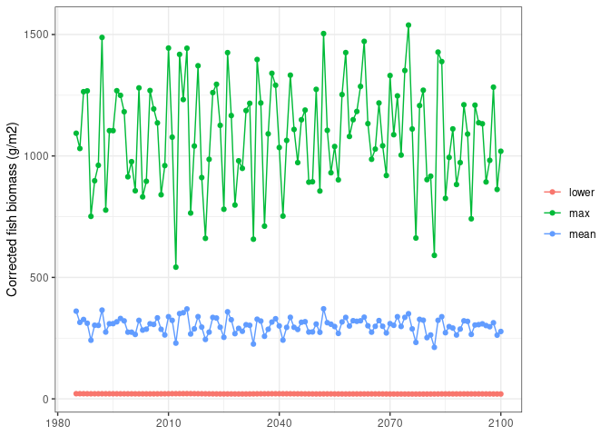
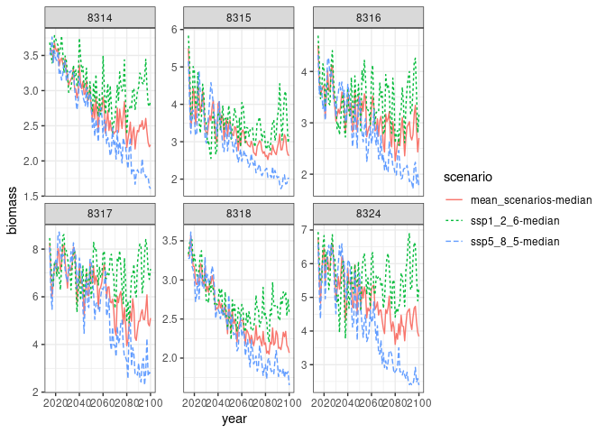

Biomass projections for Pacific Islands Countries and Territories
(PICTs)
================
Beth Fulton and Denisse Fierro Arcos
2023-11-29

- <a
  href="#marine-biomass-projections-for-pacific-islands-countries-and-territories-picts"
  id="toc-marine-biomass-projections-for-pacific-islands-countries-and-territories-picts">Marine
  biomass projections for Pacific Islands Countries and Territories
  (PICTs)</a>
  - <a href="#loading-relevant-libraries"
    id="toc-loading-relevant-libraries">Loading relevant libraries</a>
  - <a href="#models-used-to-generate-biomass-projections-for-picts"
    id="toc-models-used-to-generate-biomass-projections-for-picts">Models
    used to generate biomass projections for PICTs</a>
  - <a href="#calculating-bias-correction-for-fishmip-biomass-data"
    id="toc-calculating-bias-correction-for-fishmip-biomass-data">Calculating
    bias correction for FishMIP biomass data</a>
    - <a href="#1-calculating-fish-biomass-from-reefmod-coral-cover-data"
      id="toc-1-calculating-fish-biomass-from-reefmod-coral-cover-data">1.
      Calculating fish biomass from REEFMOD coral cover data</a>
    - <a
      href="#2-calculating-annual-mean-biomass-estimates-from-fishmip-models"
      id="toc-2-calculating-annual-mean-biomass-estimates-from-fishmip-models">2.
      Calculating annual mean biomass estimates from FishMIP models</a>
    - <a href="#3-estimating-biases-in-annual-fishmip-biomass-estimates"
      id="toc-3-estimating-biases-in-annual-fishmip-biomass-estimates">3.
      Estimating biases in annual FishMIP biomass estimates</a>
    - <a href="#plotting-corrected-biomass-for-a-single-picts"
      id="toc-plotting-corrected-biomass-for-a-single-picts">Plotting
      corrected biomass for a single PICTs</a>
- <a href="#calculating-biomass-estimates-under-scenario-ssp2-45"
  id="toc-calculating-biomass-estimates-under-scenario-ssp2-45">Calculating
  biomass estimates under scenario <code>SSP2-4.5</code></a>

# Marine biomass projections for Pacific Islands Countries and Territories (PICTs)

The workflow described in this notebook was developed by [Dr Beth
Fulton](https://orcid.org/0000-0002-5904-7917) (CSIRO) and implemented
in `R` by [Denisse Fierro Arcos](https://github.com/lidefi87/).

The [Fisheries and Marine Ecosystem Model Intercomparison Project
(FishMIP)](https://fish-mip.github.io/) includes global marine ecosystem
models that vary in their complexity and the equations they used to
capture relationships between the abiotic and biotic components of
marine ecosystems. FishMIP provide estimates of biomass of a wide range
of marine organisms, including fish and invertebrates, from 1965 to
2100. FishMIP models are forced by environmental data from two earth
system models (ESM): GFDL-ESM4.1 and IPSL-CM6A-LR. The ESM inputs used
come from the historical run (1965-2014) and two emissions scenarios:
SSP1-2.6 (low emissions) and SSP5-8.5 (high emissions).

These FishMIP models are global in scope, and so they may not truly
capture the relationships between coral cover and fish biomass. In this
notebook, we will improve FishMIP biomass projections by taking into
account the effect of coral via a bias correction, which is explained in
detailed in the sections below.

Finally, we will calculate an ensemble mean using the corrected fish
biomass values from all available FishMIP models.

## Loading relevant libraries

``` r
library(tidyverse)
library(openxlsx)
library(janitor)
```

## Models used to generate biomass projections for PICTs

A brief description of the six FishMIP models used in our ensemble is
included below, and you can click on the links to find out more
information about each model.  
1. [APECOSM](https://apecosm.org/): Apex Predators ECOSystem Model,
which represents the spatialized dynamics of open ocean pelagic
ecosystems in the global ocean.  
2. [BOATS](https://earthsystemdynamics.org/models/boats/): BiOeconomic
mArine Trophic Size-spectrum model simulates the global fishery as a
coupled ecological-economic system.  
3. [DBPM](https://bitly.ws/36wjv): The Dynamic Benthic Pelagic Model is
a dynamic size spectrum model for modelling the coupling “pelagic”
size-based predators and “benthic” detritivores that share a
unstructured resource pool (detritus).  
4. [EcoTroph](https://doi.org/10.1016/j.ecolmodel.2009.07.031): EcoTroph
models the functioning of marine ecosystems as flows of biomass from low
to high trophic levels, so as to quantify easily the impacts of fishing
at an ecosystem scale.  
5. [Macroecological](https://doi.org/10.1371/journal.pone.0133794):
Macroecological is a static equilibrium model, which uses ecological and
metabolic scaling theory to predict mean size composition and abundance
of animals (including fish).  
6. [ZooMSS](https://doi.org/10.1016/j.ecolmodel.2020.109265): The
Zooplankton Model of Size Spectra is a functional size-spectrum model of
the marine ecosystem to resolve phytoplankton, nine (9) zooplankton
functional groups (heterotrophic flagellates and ciliates, omnivorous
and carnivorous copepods, larvaceans, euphausiids, salps, chaetognaths
and jellyfish) and three size-based fish groups.

## Calculating bias correction for FishMIP biomass data

Bias corrections were derived from REEFMOD data, which describes the
relationship between coral cover and fish biomass in the Great Barrier
Reef (GBR).

### 1. Calculating fish biomass from REEFMOD coral cover data

A quick synthesis of existing relationships can be found in the document
`Relationships for fish biomass model.docx`. The most useful
relationships between coral cover and fish biomass come from the [Graham
and Nash (2013)](https://doi.org/10.1007/s00338-012-0984-y) data set
(explored in `graham_nash_2012_dataset.xlsx`).

Using the raw data from REEFMOD, we obtained the following
relationships:

**Equation 1**: Structural complexity as a function of coral cover.
($r^2$ = 0.4314)  
$struct_{complexity} = 3e^{-7} \times {coral_{cover}}^4 - 5e^{-5} \times {coral_{cover}}^3 + 0.0022 \times {coral_{cover}}^2 + 1.3892$

``` r
#Base spreadsheet
working_data <- "../Analysis/Excel Sheets/bias_correction_calculations_mean_coral_cover_all_climate_scenarios.xlsx"

#Loading coral cover data
coral <- read.xlsx(working_data, sheet = 1)

#Calculating structural complexity using equation 1 above
coral <- coral |> 
  #rearrange data to facilitate calculations
  pivot_longer(-Year, names_to = "scenario", values_to = "coral_cover") |> 
  #make names small case
  clean_names() |> 
  #calculate structural complexity
  mutate(struct_complex = (3e-7*(coral_cover^4))-((5e-5)*(coral_cover^3))+(0.0022*(coral_cover^2))+1.3892)

#Checking results
head(coral)
```

    ## # A tibble: 6 × 4
    ##    year scenario coral_cover struct_complex
    ##   <dbl> <chr>          <dbl>          <dbl>
    ## 1  2024 SSP1-1.9        17.9           1.84
    ## 2  2024 SSP1-2.6        17.9           1.84
    ## 3  2024 SSP2-4.5        18.2           1.85
    ## 4  2024 SSP3-7.0        18.2           1.85
    ## 5  2024 SSP5-8.5        18.0           1.84
    ## 6  2025 SSP1-1.9        18.0           1.84

**Equation 2**: Fish biomass ($kg \times ha^{-1}$) as a function of
structural complexity ($r^2$ = 0.6102). Note that a logistic is a little
poorer fit, so using a quadratic on the argument that once a reef
habitat is too complex, it loses places for fish to sit.  
$fish_{biomass} = -2294.6 \times {struct_{complexity}}^2 + 8961.1 \times struct_{complexity} - 6843.6$

In this step, we will also convert REEFMOD fish biomass from
$kg \times ha^{-1}$ to $g \times m^{-2}$, so it matches the outputs of
FishMIP models.

``` r
#Calculating fish biomass
coral <- coral |> 
  mutate(fish_biomass_kg_ha = (-2294.6*(struct_complex^2))+(8961.1*struct_complex)-6843.6) |> 
  mutate(fish_biomass = fish_biomass_kg_ha*1000/10000)

#Checking results
head(coral)
```

    ## # A tibble: 6 × 6
    ##    year scenario coral_cover struct_complex fish_biomass_kg_ha fish_biomass
    ##   <dbl> <chr>          <dbl>          <dbl>              <dbl>        <dbl>
    ## 1  2024 SSP1-1.9        17.9           1.84              1875.         188.
    ## 2  2024 SSP1-2.6        17.9           1.84              1875.         187.
    ## 3  2024 SSP2-4.5        18.2           1.85              1881.         188.
    ## 4  2024 SSP3-7.0        18.2           1.85              1881.         188.
    ## 5  2024 SSP5-8.5        18.0           1.84              1878.         188.
    ## 6  2025 SSP1-1.9        18.0           1.84              1877.         188.

The REEF_MOD project (of Yves-Marie Bozec and Peter Mumby at University
of Queensland) has postulated a slightly different set of relationships
from the same data (basically a linear relationship).

Fitting a line to the lower, median and upper bounds of this
relationship gives the following equations:

**Equation 3**: REEFMOD lower bound equation:
$fish_{biomass} = 12.716 \times coral_{cover} + 146.75$  
**Equation 4**: REEFMOD median equation:
$fish_{biomass} = 13.56 \times coral_{cover} + 732.15$  
**Equation 5**: REEFMOD upper bound equation:
$fish_{biomass} = 14.285 \times coral_{cover} + 1325.7$

``` r
#Calculating REEFMOD biomass values (in g/m2)
coral <- coral |> 
  #lower biomass bound
  mutate(reefmod_lower_biomass = (12.716*coral_cover+146.75)*1000/10000,
         #median biomass
         reefmod_median_biomass = (13.56*coral_cover+732.15)*1000/10000,
         #upper biomass bound
         reefmod_upper_biomass = (14.285*coral_cover+1325.7)*1000/10000) |> 
  #We will drop the biomass in Kg/ha
  select(!fish_biomass_kg_ha)

head(coral)
```

    ## # A tibble: 6 × 8
    ##    year scenario coral_cover struct_complex fish_biomass reefmod_lower_biomass
    ##   <dbl> <chr>          <dbl>          <dbl>        <dbl>                 <dbl>
    ## 1  2024 SSP1-1.9        17.9           1.84         188.                  37.4
    ## 2  2024 SSP1-2.6        17.9           1.84         187.                  37.4
    ## 3  2024 SSP2-4.5        18.2           1.85         188.                  37.8
    ## 4  2024 SSP3-7.0        18.2           1.85         188.                  37.9
    ## 5  2024 SSP5-8.5        18.0           1.84         188.                  37.6
    ## 6  2025 SSP1-1.9        18.0           1.84         188.                  37.6
    ## # ℹ 2 more variables: reefmod_median_biomass <dbl>, reefmod_upper_biomass <dbl>

Note that the REEFMOD team predicted mean coral coverage from 2024 to
2100 (`year` column) for the Great Barrier Reef (GBR) under five
emissions scenarios: `SSP1-1.9`, `SSP1-2.6`, `SSP2-4.5`, `SSP3-7.0`, and
`SSP5-8.5` (`scenario` column). Fish biomass was calculated for the
entire period (2024-2100) and for all five projections.

### 2. Calculating annual mean biomass estimates from FishMIP models

Here, we used the monthly biomass estimates for the historical period
(1985-2014) and two emissions scenarios `SSP1-2.6` and `SSP5-8.5`
(2015-2100) from [six (6) FishMIP global
models](#fish-mip-models-used-to-generate-biomass-projections-for-picts)
to calculate mean annual biomass estimates for each FishMIP model. We
used annual mean values to match the data available from REEFMOD.

**Note:** To run the code below, you will need access to the monthly
biomass estimates available in the FishMIP server. If you do not have
access to the server, we are providing the annual means in the code
chunk.

``` r
#Folder containing outputs from FishMIP models
base_folder <- "/rd/gem/private/users/camillan/Extract_tcblog10_Data/Output/sumSize_annual/sizeConsidered10g_10kg/EEZsummaries/gridded_outputs/"
#Listing all relevant files to calculate biomass projections
global_files <- list.files(base_folder, full.names = T)

#Loading PICTs EEZ mask and GBR boundaries 
mask <- read_csv("../Outputs/mask_1deg.csv")

#Defining function to extract biomass data for all PICTs from FishMIP outputs
mean_yr_bio <- function(file_name){
  da <- read_csv(file_name, col_select = x:GEONAME) |> 
    #Select data from 1985
    filter(year >= 1985) |> 
    #Rename coordinates
    rename(Lon = x, Lat = y) |> 
    #Extract GBR data - by applying mask
    right_join(mask, by = c("Lon", "Lat")) |> 
    #Calculating mean yearly biomass
    group_by(year, mem, esm, scenario, mask) |> 
    summarise(mean_annual_bio = mean(biomass, na.rm = T))
}

#Apply function to all FishMIP output files
bio_picts <- global_files |> 
  map(\(x) mean_yr_bio(x))

#Combine all list elements into a single data frame
bio_picts <- bio_picts |> 
  list_rbind()

#Saving results for later use
bio_picts |> 
  write_csv("../Outputs/average_yearly_means_picts_1985-2100.csv")

#Checking results
head(bio_picts)
```

**NOTE:** If you do not have access to the monthly biomass estimates in
the FishMIP server, you can load the annual means we calculated in the
step above and continue to run all other code chunks in this notebook.

``` r
bio_picts <- read_csv("../Outputs/average_yearly_means_picts_1985-2100.csv")
```

    ## Rows: 50500 Columns: 6
    ## ── Column specification ────────────────────────────────────────────────────────
    ## Delimiter: ","
    ## chr (3): mem, esm, scenario
    ## dbl (3): year, mask, mean_annual_bio
    ## 
    ## ℹ Use `spec()` to retrieve the full column specification for this data.
    ## ℹ Specify the column types or set `show_col_types = FALSE` to quiet this message.

### 3. Estimating biases in annual FishMIP biomass estimates

REEFMOD provides annual biomass estimates for the GBR, so we will
compare these estimates to the annual FishMIP estimates for the GBR only
(step 2 above). Note that since FishMIP models only include estimates
for two emission scenarios: `SSP1-2.6` and `SSP5-8.5`, we will exclude
all other scenarios from these comparisons.

#### Extracting GBR data from FishMIP models

As mentioned above, we will only use GBR biomass estimates from all
FishMIP models to perform comparisons. We will then calculate ensemble
minimum, mean, and maximum to calculate bias in FishMIP biomass
estimates.

``` r
#Calculating ensemble statistics for GBR only
gbr_bio <- bio_picts |> 
  ungroup() |> 
  #Select GBR means
  filter(mask == 9999) |> 
  #Rename scenarios to match coral data
  mutate(scenario = case_when(scenario == "ssp126" ~ "SSP1-2.6",
                              scenario == "ssp585" ~ "SSP5-8.5",
                              T ~ scenario)) |> 
  group_by(scenario, year) |> 
  summarise(fishmip_lower_bio = min(mean_annual_bio, na.rm = T),
            fishmip_mean_bio = mean(mean_annual_bio, na.rm = T),
            fishmip_upper_bio = max(mean_annual_bio, na.rm = T))
```

    ## `summarise()` has grouped output by 'scenario'. You can override using the
    ## `.groups` argument.

``` r
#Checking results
head(gbr_bio)
```

    ## # A tibble: 6 × 5
    ## # Groups:   scenario [1]
    ##   scenario  year fishmip_lower_bio fishmip_mean_bio fishmip_upper_bio
    ##   <chr>    <dbl>             <dbl>            <dbl>             <dbl>
    ## 1 SSP1-2.6  2015             0.643             5.01              15.7
    ## 2 SSP1-2.6  2016             0.556             5.31              16.5
    ## 3 SSP1-2.6  2017             0.560             5.18              13.8
    ## 4 SSP1-2.6  2018             0.560             5.57              18.1
    ## 5 SSP1-2.6  2019             0.630             5.10              13.8
    ## 6 SSP1-2.6  2020             0.637             5.37              14.6

#### Comparing FishMIP ensemble estimates to REEFMOD biomass estimates

To estimate the bias in FishMIP biomass estimates, we will divide the
mean ensemble estimates for the GBR (FishMIP data) by the biomass
estimates obtained from equation 2 (`fish_biomass` column in `coral`
data frame).

We will also obtain bias estimates and by dividing FishMIP ensemble
values (minimum, mean and maximum) by the median, upper, lower biomass
estimates obtained from the REEFMOD data (equations 3 to 5 stored in the
`coral` data frame).

``` r
fishmip_biases <- gbr_bio |> 
  #Adding REEFMOD biomass estimates
  inner_join(coral, by = c("scenario", "year")) |> 
  #Removing coral data that is not needed
  select(!c(coral_cover, struct_complex)) |> 
  #Calculating FishMIP ensemble biases
  mutate(mean_bias_fish_bio_fishmip = fish_biomass/fishmip_mean_bio,
         lower_bias_reefmod_fishmip = reefmod_lower_biomass/fishmip_lower_bio,
         mean_bias_reefmod_fishmip = reefmod_median_biomass/fishmip_mean_bio,
         upper_bias_reefmod_fishmip = reefmod_upper_biomass/fishmip_upper_bio)

#Check results
head(fishmip_biases)
```

    ## # A tibble: 6 × 13
    ## # Groups:   scenario [1]
    ##   scenario  year fishmip_lower_bio fishmip_mean_bio fishmip_upper_bio
    ##   <chr>    <dbl>             <dbl>            <dbl>             <dbl>
    ## 1 SSP1-2.6  2024             0.593             5.14              16.2
    ## 2 SSP1-2.6  2025             0.565             5.78              16.1
    ## 3 SSP1-2.6  2026             0.699             5.03              13.7
    ## 4 SSP1-2.6  2027             0.648             5.37              15.1
    ## 5 SSP1-2.6  2028             0.648             5.64              17.5
    ## 6 SSP1-2.6  2029             0.678             5.79              17.1
    ## # ℹ 8 more variables: fish_biomass <dbl>, reefmod_lower_biomass <dbl>,
    ## #   reefmod_median_biomass <dbl>, reefmod_upper_biomass <dbl>,
    ## #   mean_bias_fish_bio_fishmip <dbl>, lower_bias_reefmod_fishmip <dbl>,
    ## #   mean_bias_reefmod_fishmip <dbl>, upper_bias_reefmod_fishmip <dbl>

After these calculations, we have FishMIP bias estimates per year
(2024-2100) and for each scenario (SSP1-2.6 and SSP5-8.5). In the next
step, we will calculate a mean estimate of bias per scenario before
applying this value as a correction for FishMIP biomass estimates.

#### 4. Correcting FishMIP ensemble mean estimates of fish biomass

As explained in the previous step, we will not apply a bias correction
that varies every year. Instead, for each scenario, we will calculate
the minimum, mean, median, and maximum bias estimate. We will use these
biases as corrections.

    ## # A tibble: 6 × 6
    ##   scenario stat   mean_bias_fish_bio_fishmip lower_bias_reefmod_fishmip
    ##   <chr>    <chr>                       <dbl>                      <dbl>
    ## 1 SSP1-2.6 min                          25.0                       26.6
    ## 2 SSP1-2.6 mean                         32.0                       43.6
    ## 3 SSP1-2.6 median                       32.4                       41.7
    ## 4 SSP1-2.6 max                          41.3                       67.3
    ## 5 SSP5-8.5 min                          23.3                       18.0
    ## 6 SSP5-8.5 mean                         29.4                       30.7
    ## # ℹ 2 more variables: mean_bias_reefmod_fishmip <dbl>,
    ## #   upper_bias_reefmod_fishmip <dbl>

Bias corrections will be applied to ensemble data, so we will calculate
the minimum, mean and maximum biomass estimates per PICT across all
FishMIP models.

``` r
ensemble_bio <- bio_picts |>
  #Removing GBR data
  filter(mask != 9999) |> 
   #Rename scenarios to match coral data
  mutate(scenario = case_when(scenario == "ssp126" ~ "SSP1-2.6",
                              scenario == "ssp585" ~ "SSP5-8.5",
                              T ~ scenario)) |> 
  #Calculations performed by year and EEZ
  group_by(mask, scenario, year) |> 
  #Apply calculations to biases only
  summarise(across(mean_annual_bio, 
                   #Listing statistics to be calculated
                   list(lower = min, mean = mean, max = max), 
                   #Setting column names
                   .names = "{.col}-{.fn}")) |> 
  #Restructuring data frame to ease corrected biomass calculations
  pivot_longer(!c(mask:year), names_to = "ensemble_type", values_to = "ensemble_bio") |> 
  #Separating bias type from statistic calculated
  separate_wider_delim(cols = "ensemble_type", delim = "-", names = c("ensemble_type", "stat")) |> 
  pivot_wider(names_from = ensemble_type, values_from = ensemble_bio)
```

    ## `summarise()` has grouped output by 'mask', 'scenario'. You can override using
    ## the `.groups` argument.

``` r
#Checking results
head(ensemble_bio)
```

    ## # A tibble: 6 × 5
    ## # Groups:   mask, scenario [1]
    ##    mask scenario  year stat  mean_annual_bio
    ##   <dbl> <chr>    <dbl> <chr>           <dbl>
    ## 1  8312 SSP1-2.6  2015 lower           0.872
    ## 2  8312 SSP1-2.6  2015 mean            4.26 
    ## 3  8312 SSP1-2.6  2015 max             8.05 
    ## 4  8312 SSP1-2.6  2016 lower           0.804
    ## 5  8312 SSP1-2.6  2016 mean            4.70 
    ## 6  8312 SSP1-2.6  2016 max             8.27

REEFMOD includes data from 2024 onwards, but FishMIP data is available
from 1985. This means that we do not have bias estimates before 2024, so
we will use the mean bias for scenario `SSP1-2.6` to correct fish
estimates for the historical period (1985-2014) and the first eight
years (2015-2023) of the two emissions scenarios (SSP1-2.6 and
SSP5-8.5). We chose to use the mean bias of the low emissions scenario
because if mean bias from `SSP5-8.5` was used, the historical biomass
values became too divergent.

Finally, we produced corrected biomass from the FishMIP ensemble by
applying this formula:
$biomass_{est} = ensemble_{biomass} \times bias_{correction}$.

``` r
#Extracting mean biases from SSP1-2.6
mean_biases <- mean_biases |> 
  filter(stat == "mean" & scenario == "SSP1-2.6") |> 
  select(ends_with("mip")) |>
  #Matching dimension of FishMIP data to perform bias corrections
  mutate(count = nrow(ensemble_bio)) |> 
  uncount(count)

#Join FishMIP data and mean bias
bias_corr_biomass <- ensemble_bio |> 
  bind_cols(mean_biases) |> 
  #Applying corrections to biomass
  mutate(bio_corr_nash = mean_annual_bio*mean_bias_fish_bio_fishmip,
         bio_corr_reefmod_low = mean_annual_bio*lower_bias_reefmod_fishmip,
         bio_corr_reefmod_mean = mean_annual_bio*mean_bias_reefmod_fishmip,
         bio_corr_reefmod_upper = mean_annual_bio*upper_bias_reefmod_fishmip) |> 
  #Keeping only corrected columns
  select(!mean_annual_bio:upper_bias_reefmod_fishmip)

#Saving outputs
bias_corr_biomass |> 
  #Adding units for corrected biomass values
  mutate(biomass_units = "g/m2") |> 
  write_csv("../Outputs/yearly_corrected_biomass_picts_1985-2100.csv")

#Checking result
head(bias_corr_biomass)
```

    ## # A tibble: 6 × 8
    ## # Groups:   mask, scenario [1]
    ##    mask scenario  year stat  bio_corr_nash bio_corr_reefmod_low
    ##   <dbl> <chr>    <dbl> <chr>         <dbl>                <dbl>
    ## 1  8312 SSP1-2.6  2015 lower          27.9                 38.0
    ## 2  8312 SSP1-2.6  2015 mean          136.                 186. 
    ## 3  8312 SSP1-2.6  2015 max           258.                 351. 
    ## 4  8312 SSP1-2.6  2016 lower          25.7                 35.1
    ## 5  8312 SSP1-2.6  2016 mean          151.                 205. 
    ## 6  8312 SSP1-2.6  2016 max           265.                 361. 
    ## # ℹ 2 more variables: bio_corr_reefmod_mean <dbl>, bio_corr_reefmod_upper <dbl>

### Plotting corrected biomass for a single PICTs

We will use biomass values corrected with the Nash derived equation from
Kiribati (`mask` = 8441) for the historical period and scenario
`SSP1-2.6` as an example.

``` r
bias_corr_biomass |> 
  ungroup() |> 
  filter(mask == 8441 & scenario != "SSP5-8.5") |> 
  ggplot(aes(x = year, y = bio_corr_nash, color = stat))+
  geom_line()+
  geom_point()+
  theme_bw()+
  labs(y = "Corrected fish biomass (g/m2)")+
  theme(axis.title.x = element_blank(), legend.title = element_blank())
```

<!-- -->

# Calculating biomass estimates under scenario `SSP2-4.5`

FishMIP models provide biomass estimates under a low emissions
(`SSP1-2.6`) and a high emissions (`SSP5-8.5`) scenarios. None of them
provide biomass estimates under a moderate emissions scenario
(`SSP2-4.5`). We will provide a rough estimate of biomass under
`SSP2-4.5` by calculating the mean between the low (`SSP1-2.6`) and high
(`SSP5-8.5`) emissions scenarios.

We justify the use of this approach based on the REEFMOD data, which
includes estimates of coral cover under the three scenarios of interest:
`SSP1-2.6`, `SSP2-4.5`, and `SSP5-8.5`. Below, we plot coral cover under
the three scenarios.

``` r
#Visualising data
p1 <- coral |> 
  #Selecting three relevant scenarios
  filter(str_detect(scenario, "2.6|4.5|8.5")) |> 
  #Plot coral cover for all scenarios
  ggplot(aes(x = year, y = coral_cover, colour = scenario, linetype = scenario))+
  geom_line()+
  theme_bw()+
  labs(y = "Coral cover (%)")+
  theme(axis.title.x = element_blank(), 
        legend.position = "top", legend.direction = "horizontal")
p1
```

<!-- -->

We will now calculate the mean biomass estimated under of scenarios
`SSP1-2.6` and `SSP5-8.5`. We will add this to our figure as a black
line to check how well it represents the moderate emissions data.

``` r
mean_26_85 <- coral |> 
  #Selecting three relevant scenarios
  filter(str_detect(scenario, "2.6|4.5|8.5")) |> 
  #Keeping only columns between year and coral cover
  select(year:coral_cover) |>
  #Reorganise data, so coral cover is now labelled by scenario
  pivot_wider(names_from = scenario, values_from = coral_cover) |> 
  #Clean up column names
  clean_names() |> 
  rowwise() |> 
  mutate(mean_scenarios = mean(c(ssp1_2_6, ssp5_8_5))) |> 
  ungroup()

p1+
  geom_line(inherit.aes = F, data = mean_26_85, aes(x = year, y = mean_scenarios))
```

<!-- -->

The averaged coral cover (black line) is closer to coral cover under
scenario `SSP2-4.5` (green dashed line) than either of the two
scenarios. This approach is simple, but note that before 2060, it tends
to underestimate coral cover. However, after 2060 coral cover is
overestimated. We expect similar biases when calculating fish biomass
under the moderate emissions scenario.

We will now calculate fish biomass estimates under `SSP2-4.5` for
FishMIP models.

``` r
biomass_ssp245 <- bio_picts |> 
  #select data for future scenarios only
  filter(scenario != "historical") |> 
  #Reformat data before calculating mean scenario (SSP126 and SSP585)
  pivot_wider(names_from = scenario, values_from = mean_annual_bio) |> 
  rowwise() |> 
  #Calculate mean scenario
  mutate(mean_scenarios = mean(c(ssp126, ssp585))) |> 
  ungroup() |> 
  #Rename columns to match GBR data
  rename("ssp1_2_6" = "ssp126", "ssp5_8_5" = "ssp585")
  

biomass_ssp245 <- biomass_ssp245 |> 
  #Calculations performed by year and EEZ
  group_by(mask, year) |>
  summarise(across(ssp1_2_6:mean_scenarios, 
                   #Listing statistics to be calculated
                   list(min = min, median = median, max = max), 
                   #Setting column names
                   .names = "{.col}-{.fn}")) |> 
  ungroup()
```

    ## `summarise()` has grouped output by 'mask'. You can override using the
    ## `.groups` argument.

We can plot the fish biomass estimates of the first four PICTs to check
the results.

``` r
biomass_ssp245 |> 
  filter(mask %in% c(8318, 8316, 8317, 8315, 8324, 8314)) |> 
  #We will only plot the median values
  select(mask, year, ends_with("median")) |> 
  #Reformat data to make plotting easier
  pivot_longer(ends_with("median"), names_to = "scenario", values_to = "biomass") |> 
  #Plotting
  ggplot(aes(x = year, y = biomass, colour = scenario, linetype = scenario))+
  geom_line()+
  facet_wrap(~mask, scales = "free_y")+
  theme_bw()
```

<!-- -->

It should be noted that we attempted to apply corrections to the
projected biomass estimates. However, results appeared to be unlikely
for the moderate emissions scenario.
