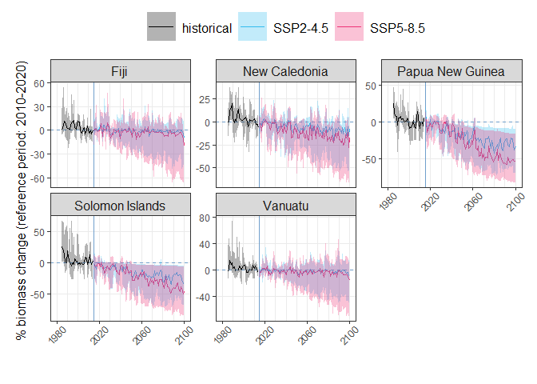
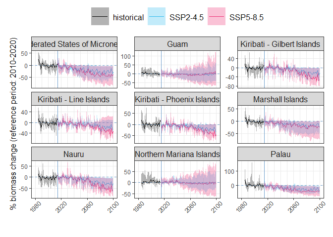
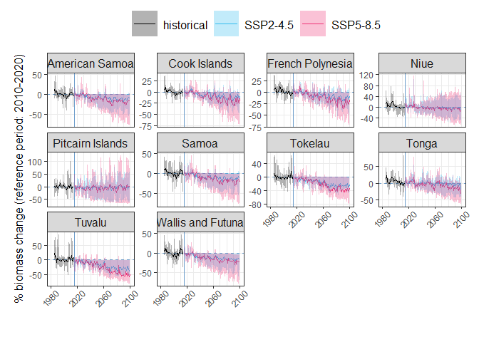

Plotting biomass projections for PICTs
================
Denisse Fierro Arcos
2023-12-13

- [Plotting percentage change in FishMIP biomass
  estimates](#plotting-percentage-change-in-fishmip-biomass-estimates)
  - [Loading libraries](#loading-libraries)
  - [Loading biomass data from FishMIP
    models](#loading-biomass-data-from-fishmip-models)
  - [Calculating mean for reference
    period](#calculating-mean-for-reference-period)
  - [Plotting data](#plotting-data)
    - [Melanesia plot](#melanesia-plot)
    - [Micronesia plot](#micronesia-plot)
    - [Polynesia plot](#polynesia-plot)

# Plotting percentage change in FishMIP biomass estimates

The [Fisheries and Marine Ecosystem Model Intercomparison Project
(FishMIP)](https://fish-mip.github.io/) includes global marine ecosystem
models that vary in their complexity and the equations they used to
capture relationships between the abiotic and biotic components of
marine ecosystems. FishMIP provide estimates of biomass of a wide range
of marine organisms, including fish and invertebrates, from 1965 to
2100. FishMIP models are forced by environmental data from two earth
system models (ESM): GFDL-ESM4.1 and IPSL-CM6A-LR. The ESM inputs used
come from the historical run (1965-2014) and two emissions scenarios:
SSP1-2.6 (low emissions) and SSP5-8.5 (high emissions).

Given that FishMIP models represent the marine environment differently,
the biomass estimates provided by these models span three orders of
magnitude. For this reason, instead of focusing on the absolute changes
in biomass, we will report relative change in biomass from a reference
period (2010-2020). To improve the accuracy in biomass predictions, we
will calculate the median percentage change in fish biomass across all
models. To provide an indication of uncertainty in our ensemble, we are
providing minimum and maximum values of change across models.

Given that FishMIP models do not provide estimates of biomass under an
intermediate emissions scenario (SSP2-4.5), we calculated an estimate
for this scenario by calculating the mean between SSP1-2.6 and SSP5-8.5
as explained in the [biomass projection
notebook](https://github.com/Fish-MIP/Extract_PICTs/blob/main/Scripts/04_Biomass_projections_SouthPacific.md).

Changes in fish biomass were calculated and reported for each PICT.

## Loading libraries

``` r
library(readr)
library(dplyr)
library(ggplot2)
library(stringr)
library(tidyr)
```

## Loading biomass data from FishMIP models

``` r
#Loading keys identifying EEZs
PICTS_keys <- read_csv("../Outputs/SouthPacific_EEZ-GBR_keys.csv") |> 
  #Removing original ID - using simplified version
  select(!MRGID) |> 
  #Remove duplicates
  distinct() |> 
  #Add region information
  left_join(read_csv("../Data/PICT_regions.csv"), 
            by = join_by("name")) |> 
  mutate(name = case_when(str_detect(name, "FSM") ~ 
                            "Federated States of Micronesia",
                          name == "Pitcairn" ~ "Pitcairn Islands",
                          T ~ name),
         name = str_replace(name, "Group", "Islands"))
```

    ## Rows: 26 Columns: 3
    ## ── Column specification ────────────────────────────────────────────────────────
    ## Delimiter: ","
    ## chr (1): name
    ## dbl (2): ID, MRGID
    ## 
    ## ℹ Use `spec()` to retrieve the full column specification for this data.
    ## ℹ Specify the column types or set `show_col_types = FALSE` to quiet this message.
    ## Rows: 24 Columns: 2
    ## ── Column specification ────────────────────────────────────────────────────────
    ## Delimiter: ","
    ## chr (2): name, Region
    ## 
    ## ℹ Use `spec()` to retrieve the full column specification for this data.
    ## ℹ Specify the column types or set `show_col_types = FALSE` to quiet this message.

``` r
#Loading FishMIP biomass data
bio_picts <- read_csv("../Outputs/average_yearly_means_picts_1985-2100.csv")|>
  #Removing GBR data
  filter(mask != 9999)
```

    ## Rows: 50500 Columns: 6
    ## ── Column specification ────────────────────────────────────────────────────────
    ## Delimiter: ","
    ## chr (3): mem, esm, scenario
    ## dbl (3): year, mask, mean_annual_bio
    ## 
    ## ℹ Use `spec()` to retrieve the full column specification for this data.
    ## ℹ Specify the column types or set `show_col_types = FALSE` to quiet this message.

``` r
#Calculating SSP2-4.5 biomass estimates
bio_picts_ssp245 <- bio_picts |> 
  #select data for future scenarios only
  filter(scenario != "historical") |> 
  #Reformat data before calculating mean scenario (SSP126 and SSP585)
  pivot_wider(names_from = scenario, values_from = mean_annual_bio) |> 
  rowwise() |> 
  #Calculate mean scenario
  mutate(ssp245_est = mean(c(ssp126, ssp585))) |> 
  ungroup() |> 
  #Removing columns not needed
  select(!(ssp126:ssp585)) |> 
  #Rearranging data before merging to original FishMIP scenarios
  pivot_longer(ssp245_est, names_to = "scenario", values_to = "mean_annual_bio") |> 
  #Ensuring column locations match
  relocate(mask, .after = scenario) |> 
  #Merging data frames
  bind_rows(bio_picts) |> 
  #Rename scenarios to match coral data
  mutate(scenario = case_when(scenario == "ssp126" ~ "SSP1-2.6",
                              scenario == "ssp245_est" ~ "SSP2-4.5",
                              scenario == "ssp585" ~ "SSP5-8.5",
                              T ~ scenario))
```

## Calculating mean for reference period

Plots created here will show percentage change in biomass over time
under two emissions scenarios rather than absolute values. Our reference
period is between 2010 and 2020. From 2010 to 2014, biomass from the
historical period will be used, and between 2015 and 2020 we will use
`SSP1-2.6` data as this is the best case scenario.

``` r
#Calculating mean for reference decade (2010-2020)
ref_decade <- bio_picts |>
  filter(year >= 2010 & year <= 2020) |> 
  filter(str_detect(scenario, "585", negate = T)) |> 
  group_by(mem, esm, mask) |> 
  summarise(ref = mean(mean_annual_bio))
```

    ## `summarise()` has grouped output by 'mem', 'esm'. You can override using the
    ## `.groups` argument.

``` r
#Calculating proportion of biomass in relation to reference decade
bio_plots <- bio_picts_ssp245 |> 
  left_join(ref_decade, by = c("mem", "esm", "mask")) |> 
  mutate(rel_change = ((mean_annual_bio-ref)/ref)*100) |> 
  #Calculations performed by year and EEZ
  group_by(mask, scenario, year) |> 
  #Apply calculations to biases only
  summarise(across(rel_change, 
                   #Listing statistics to be calculated
                   list(lower = min, median = median, max = max), 
                   #Setting column names
                   .names = "{.col}_{.fn}")) |> 
  ungroup() |> 
  left_join(PICTS_keys, by = c("mask"="ID"))
```

    ## `summarise()` has grouped output by 'mask', 'scenario'. You can override using
    ## the `.groups` argument.

``` r
#Saving results
bio_plots |> 
  write_csv("../Outputs/yearly_relative_biomass_change_1985-2100.csv")

#Checking results
head(bio_plots)
```

    ## # A tibble: 6 × 8
    ##    mask scenario  year rel_change_lower rel_change_median rel_change_max name   
    ##   <dbl> <chr>    <dbl>            <dbl>             <dbl>          <dbl> <chr>  
    ## 1  8312 SSP1-2.6  2015           -12.3             -2.20            3.82 New Ca…
    ## 2  8312 SSP1-2.6  2016           -11.6              0.619          26.3  New Ca…
    ## 3  8312 SSP1-2.6  2017            -4.66             3.07            5.02 New Ca…
    ## 4  8312 SSP1-2.6  2018            -8.56             2.25           21.3  New Ca…
    ## 5  8312 SSP1-2.6  2019            -1.59             3.31           21.1  New Ca…
    ## 6  8312 SSP1-2.6  2020            -4.33             1.04            6.84 New Ca…
    ## # ℹ 1 more variable: Region <chr>

## Plotting data

We will remove the lowest emission scenario (`SSP1-2.6`) before plotting
relative change in biomass. We will create three plots based on the
three cultural regions found in this area: Melanesia, Micronesia, and
Polynesia. All plots will follow the same format, so we will define a
base plot and apply it to all regions.

``` r
base_gg <- list(geom_line(linewidth = 0.5),
                #Horizontal line at 0 as reference for no change
                geom_hline(yintercept = 0, color = "#709fcc", 
                           linewidth = 0.65, linetype = 2),
                #Vertical line showing reference between historical and future
                #scenarios
                geom_vline(xintercept = 2015, color = "#709fcc", 
                           linewidth = 0.65),
                #Add ribbon (min and max)
                geom_ribbon(aes(ymin = rel_change_lower, ymax = rel_change_max, 
                                fill = scenario), alpha = 0.3, color = NA),
                #Change x scale to make it easier to identify years
                scale_x_continuous(minor_breaks = seq(1980, 2100, by = 10),
                                   breaks = seq(1980, 2100, by = 40), 
                                   limits = c(1980, 2100)),
                #Make individual plots by PICT
                facet_wrap(~name, scales = "free_y"),
                #Change line colours 
                scale_color_manual(values = c("historical" = "black", 
                                              "SSP2-4.5" = "#33bbee", 
                                              "SSP5-8.5" = "#ee3377")),
                #Change ribbon colours
                scale_fill_manual(values = c("historical" = "black", 
                                             "SSP2-4.5" = "#33bbee", 
                                             "SSP5-8.5" = "#ee3377")),
                #Ensure legend has three rows
                guides(color = guide_legend(ncol = 3, label.hjust = 0.5)),
                #Apply pre-defined theme
                theme_bw(),
                #Final changes to make plot more appealing and easy to read
                theme(legend.position = "top", 
                      legend.key.size = unit(1., "cm"),
                      panel.grid.minor.y = element_blank(),
                      plot.margin = margin(b = 1.15, r = 0.5, l = 0.5, t = 0.2, 
                                           unit = "cm"),
                      legend.text = element_text(size = 12), 
                      strip.text = element_text(size = 12), 
                      axis.title.x = element_blank(),
                      legend.title = element_blank(), 
                      axis.title.y = element_text(size = 12),
                      axis.text.x = element_text(angle = 45, vjust = 0.765, 
                                                 hjust = 0.65)),
                #Chaning labels in y axis
                ylab("% biomass change (reference period: 2010-2020)"))
```

### Melanesia plot

``` r
bio_plots |> 
  #Removing lowest emission scenario
  filter(str_detect(scenario, "2.6", negate = T) & Region == "Melanesia") |> 
  ggplot(aes(x = year, y = rel_change_median, color = scenario))+
  base_gg
```

<!-- -->

``` r
ggsave("../Outputs/melanesia_relative_biomass_change.pdf", device = "pdf", 
       width = 12, height = 6)
```

### Micronesia plot

``` r
bio_plots |> 
  #Removing lowest emission scenario
  filter(str_detect(scenario, "2.6", negate = T) & Region == "Micronesia") |> 
  ggplot(aes(x = year, y = rel_change_median, color = scenario))+
  base_gg
```

<!-- -->

``` r
ggsave("../Outputs/micronesia_relative_biomass_change.pdf", device = "pdf", 
       width = 12, height = 8)
```

### Polynesia plot

``` r
bio_plots |> 
  #Removing lowest emission scenario
  filter(str_detect(scenario, "2.6", negate = T) & Region == "Polynesia") |> 
  ggplot(aes(x = year, y = rel_change_median, color = scenario))+
  base_gg
```

<!-- -->

``` r
ggsave("../Outputs/polynesia_relative_biomass_change.pdf", device = "pdf", 
       width = 12, height = 8)
```
