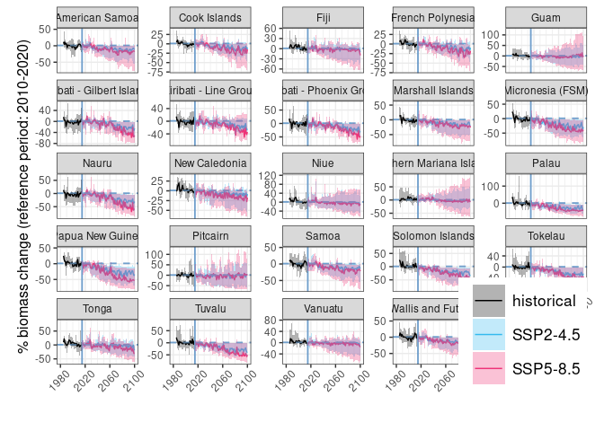

Plotting biomass projections for PICTs
================
Denisse Fierro Arcos
2023-12-13

- <a href="#loading-libraries" id="toc-loading-libraries">Loading
  libraries</a>
- <a href="#loading-biomass-data-from-fishmip-models"
  id="toc-loading-biomass-data-from-fishmip-models">Loading biomass data
  from FishMIP models</a>
- <a href="#calculating-mean-for-reference-period"
  id="toc-calculating-mean-for-reference-period">Calculating mean for
  reference period</a>
- <a href="#plotting-data" id="toc-plotting-data">Plotting data</a>
  - <a href="#saving-plots" id="toc-saving-plots">Saving plots</a>

## Loading libraries

``` r
library(readr)
library(dplyr)
library(ggplot2)
library(stringr)
library(tidyr)
```

## Loading biomass data from FishMIP models

``` r
#Loading keys identifying EEZs
PICTS_keys <- read_csv("../Outputs/SouthPacific_EEZ-GBR_keys.csv") |> 
  #Removing original ID - using simplified version
  select(!MRGID)
```

    ## Rows: 26 Columns: 3
    ## ── Column specification ────────────────────────────────────────────────────────
    ## Delimiter: ","
    ## chr (1): name
    ## dbl (2): ID, MRGID
    ## 
    ## ℹ Use `spec()` to retrieve the full column specification for this data.
    ## ℹ Specify the column types or set `show_col_types = FALSE` to quiet this message.

``` r
#Loading FishMIP biomass data
bio_picts <- read_csv("../Outputs/average_yearly_means_picts_1985-2100.csv")|>
  #Removing GBR data
  filter(mask != 9999)
```

    ## Rows: 46460 Columns: 6
    ## ── Column specification ────────────────────────────────────────────────────────
    ## Delimiter: ","
    ## chr (3): mem, esm, scenario
    ## dbl (3): year, mask, mean_annual_bio
    ## 
    ## ℹ Use `spec()` to retrieve the full column specification for this data.
    ## ℹ Specify the column types or set `show_col_types = FALSE` to quiet this message.

``` r
#Calculating SSP2-4.5 biomass estimates
bio_picts_ssp245 <- bio_picts |> 
  #select data for future scenarios only
  filter(scenario != "historical") |> 
  #Reformat data before calculating mean scenario (SSP126 and SSP585)
  pivot_wider(names_from = scenario, values_from = mean_annual_bio) |> 
  rowwise() |> 
  #Calculate mean scenario
  mutate(ssp245_est = mean(c(ssp126, ssp585))) |> 
  ungroup() |> 
  #Removing columns not needed
  select(!(ssp126:ssp585)) |> 
  #Rearranging data before merging to original FishMIP scenarios
  pivot_longer(ssp245_est, names_to = "scenario", values_to = "mean_annual_bio") |> 
  #Ensuring column locations match
  relocate(mask, .after = scenario) |> 
  #Merging data frames
  bind_rows(bio_picts) |> 
  #Rename scenarios to match coral data
  mutate(scenario = case_when(scenario == "ssp126" ~ "SSP1-2.6",
                              scenario == "ssp245_est" ~ "SSP2-4.5",
                              scenario == "ssp585" ~ "SSP5-8.5",
                              T ~ scenario))
```

## Calculating mean for reference period

Plots created here will show percentage change in biomass over time
under two emissions scenarios rather than absolute values. Our reference
period is between 2010 and 2020. From 2010 to 2014, biomass from the
historical period will be used, and between 2015 and 2020 we will use
`SSP1-2.6` data as this is the best case scenario.

``` r
#Calculating mean for reference decade (2010-2020)
ref_decade <- bio_picts |>
  filter(year >= 2010 & year <= 2020) |> 
  filter(str_detect(scenario, "585", negate = T)) |> 
  group_by(mem, esm, mask) |> 
  summarise(ref = mean(mean_annual_bio))
```

    ## `summarise()` has grouped output by 'mem', 'esm'. You can override using the
    ## `.groups` argument.

``` r
#Calculating proportion of biomass in relation to reference decade
bio_plots <- bio_picts_ssp245 |> 
  left_join(ref_decade, by = c("mem", "esm", "mask")) |> 
  mutate(rel_change = ((mean_annual_bio-ref)/ref)*100) |> 
  #Calculations performed by year and EEZ
  group_by(mask, scenario, year) |> 
  #Apply calculations to biases only
  summarise(across(rel_change, 
                   #Listing statistics to be calculated
                   list(lower = min, median = median, max = max), 
                   #Setting column names
                   .names = "{.col}_{.fn}")) |> 
  ungroup() |> 
  left_join(PICTS_keys, by = c("mask"="ID"))
```

    ## `summarise()` has grouped output by 'mask', 'scenario'. You can override using
    ## the `.groups` argument.

    ## Warning in left_join(ungroup(summarise(group_by(mutate(left_join(bio_picts_ssp245, : Detected an unexpected many-to-many relationship between `x` and `y`.
    ## ℹ Row 2017 of `x` matches multiple rows in `y`.
    ## ℹ Row 26 of `y` matches multiple rows in `x`.
    ## ℹ If a many-to-many relationship is expected, set `relationship =
    ##   "many-to-many"` to silence this warning.

``` r
#Checking results
head(bio_plots)
```

    ## # A tibble: 6 × 7
    ##    mask scenario  year rel_change_lower rel_change_median rel_change_max name   
    ##   <dbl> <chr>    <dbl>            <dbl>             <dbl>          <dbl> <chr>  
    ## 1  8312 SSP1-2.6  2015          -13.3              -1.81            4.63 New Ca…
    ## 2  8312 SSP1-2.6  2016          -11.9               0.701          30.7  New Ca…
    ## 3  8312 SSP1-2.6  2017           -5.50              1.06            4.11 New Ca…
    ## 4  8312 SSP1-2.6  2018           -9.33              1.33           21.1  New Ca…
    ## 5  8312 SSP1-2.6  2019           -0.361             3.04           20.1  New Ca…
    ## 6  8312 SSP1-2.6  2020           -4.98              0.965           5.54 New Ca…

## Plotting data

``` r
bio_plots |> 
  ggplot(aes(x = year, y = rel_change_median, color = scenario))+
  geom_line(linewidth = 0.5)+
  geom_hline(yintercept = 1, color = "#709fcc", linewidth = 0.65, linetype = 2)+
  geom_vline(xintercept = 2015, color = "#709fcc", linewidth = 0.65)+
  geom_ribbon(aes(ymin = rel_change_lower, ymax = rel_change_max, fill = scenario),
              alpha = 0.3, color = NA)+
  scale_x_continuous(minor_breaks = seq(1980, 2100, by = 10),
                     breaks = seq(1980, 2100, by = 40), limits = c(1980, 2100))+
  facet_wrap(~name, scales = "free_y")+
  scale_color_manual(values = c("historical" = "black", "SSP1-2.6" = "#7570b3",
                                "SSP2-4.5" = "#fc8d62", "SSP5-8.5" = "#1b9e77"))+
  scale_fill_manual(values = c("historical" = "black", "SSP1-2.6" = "#7570b3",
                                "SSP2-4.5" = "#fc8d62", "SSP5-8.5" = "#1b9e77"))+
  theme_bw()+
  theme(legend.position = "bottom", legend.justification = "right",
        legend.box.spacing = unit(-2, "cm"), panel.grid.minor.y = element_blank(),
        plot.margin = margin(b = 1.05, r = 0.5, l = 0.5, t = 0.2, unit = "cm"),
        legend.text = element_text(size = 11), axis.title.x = element_blank(),
        legend.title = element_blank(), axis.title.y = element_text(size = 12),
        axis.text.x = element_text(angle = 45, vjust = 0.765, hjust = 0.65))+
  ylab("% biomass change (reference period: 2010-2020)")
```

<!-- -->

### Saving plots

``` r
ggsave("../Outputs/relative_biomass_change.pdf", device = "pdf", width = 14, height = 9)
```
