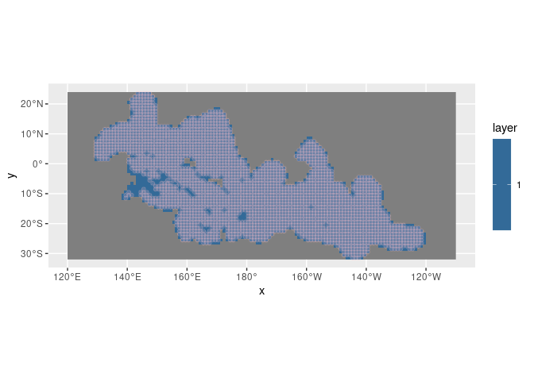

Mapping biomass change under two emissions scenarios for PICTs
================
Denisse Fierro Arcos
2024-01-03

- <a href="#loading-libraries" id="toc-loading-libraries">Loading
  libraries</a>
- <a href="#loading-information-about-picts"
  id="toc-loading-information-about-picts">Loading information about
  PICTs</a>
- <a href="#loading-fish-biomass-estimates-from-fishmip-models"
  id="toc-loading-fish-biomass-estimates-from-fishmip-models">Loading fish
  biomass estimates from FishMIP models</a>
- <a href="#calculating--change-in-fish-biomass-for-fishmip-ensemble"
  id="toc-calculating--change-in-fish-biomass-for-fishmip-ensemble">Calculating
  % change in fish biomass for FishMIP ensemble</a>
- <a href="#estimating-biomass-values-in-coastal-areas"
  id="toc-estimating-biomass-values-in-coastal-areas">Estimating biomass
  values in coastal areas</a>
  - <a href="#preparing-grid-to-be-used-for-interpolations"
    id="toc-preparing-grid-to-be-used-for-interpolations">Preparing grid to
    be used for interpolations</a>
- <a href="#loading-relevant-shapefiles"
  id="toc-loading-relevant-shapefiles">Loading relevant shapefiles</a>
- <a href="#plotting-maps" id="toc-plotting-maps">Plotting maps</a>
  - <a href="#creating-colour-palette"
    id="toc-creating-colour-palette">Creating colour palette</a>
  - <a href="#creating-individual-maps"
    id="toc-creating-individual-maps">Creating individual maps</a>
  - <a href="#saving-final-plot" id="toc-saving-final-plot">Saving final
    plot</a>

# Loading libraries

``` r
library(data.table)
library(tidyverse)
library(rnaturalearth)
library(cmocean)
library(cowplot)
library(sf)
library(gstat)
library(stars)
library(terra)
```

# Loading information about PICTs

This dataset will allow us to identify the country associated to each
unique ID in the fish biomass estimates from FishMIP models. We will
exclude the Great Barrier Reef (GBR) because it is not relevant here.

``` r
#Loading PICTs EEZ mask and GBR boundaries 
mask <- read_csv("../Outputs/mask_1deg.csv") |> 
  #Adding names to identify PICTS
  left_join(read_csv("../Outputs/SouthPacific_EEZ-GBR_keys.csv", col_select = c(name, MRGID)),
            by = c("mask"= "MRGID")) |> 
  #Rename coordinates
  rename(x = Lon, y = Lat)
```

    ## Rows: 2746 Columns: 3
    ## ── Column specification ────────────────────────────────────────────────────────
    ## Delimiter: ","
    ## dbl (3): Lon, Lat, mask
    ## 
    ## ℹ Use `spec()` to retrieve the full column specification for this data.
    ## ℹ Specify the column types or set `show_col_types = FALSE` to quiet this message.
    ## Rows: 26 Columns: 2
    ## ── Column specification ────────────────────────────────────────────────────────
    ## Delimiter: ","
    ## chr (1): name
    ## dbl (1): MRGID
    ## 
    ## ℹ Use `spec()` to retrieve the full column specification for this data.
    ## ℹ Specify the column types or set `show_col_types = FALSE` to quiet this message.

# Loading fish biomass estimates from FishMIP models

We will create maps that show the percentage change in fish biomass
under two scenarios: `SSP2-4.5` and `SSP5-8.5` for the decades between
2045 and 2055, and between 2085 and 2095. First, we will identify all
files containing relevant information and then we will extract the data
we need to create our maps.

``` r
#Folder containing outputs from FishMIP models
base_folder <- "/rd/gem/private/users/camillan/Extract_tcblog10_Data/Output/sumSize_annual/sizeConsidered10g_10kg/EEZsummaries/gridded_outputs/"
#Listing all relevant files to calculate biomass projections
global_files <- list.files(base_folder, full.names = T)
#Models
members <- str_extract(global_files, "outputs//(.*)_(h|s)", group = 1) |> 
  unique()
```

We will go through each file, extract biomass estimates for `SSP1-2.6`
and `SSP5-8.5` to estimate biomass under a moderate emissions scenario
(`SSP2-4.5`) because FishMIP models do not include this scenario. As
explained in the
[04_Biomass_projection_SouthPacific](https://github.com/Fish-MIP/Extract_PICTs/blob/main/Scripts/04_Biomass_projections_SouthPacific.md)
notebook, `SSP2-4.5` biomass estimates are calculated by taking the mean
of the lowest and highest emissions scenarios (`SSP1-2.6` and
`SSP5-8.5`).

We should note that this approach provides a rough estimate of fish
biomass under `SSP2-4.5`, which may result in an under estimate prior to
2060, and an overestimate after 2080.

``` r
for(m in members){
  #Load all data available for a single FishMIP model
  df_model <- str_subset(global_files, m) |> 
    #Ignore columns SOVEREIGN1-3 - not needed here
    map_df(~fread(., drop = c(paste0("SOVEREIGN", 1:3), "area_m", "eez", "GEONAME"))) |> 
    #Extract data only for years to be used in maps
    filter(year >= 2010 & year <= 2020 | year >= 2045 & year <= 2055 | year >= 2085 & year <= 2095) |> 
    #Do not keep data before 2021 for scenario ssp585
    filter(!((year >= 2015 & year <= 2020) & scenario == "ssp585")) |> 
    #Applying mask to classify by PICT
    right_join(mask, by = c("x", "y"))|> 
    #Remove grid cells that are not within PICT boundaries
    drop_na(mask) |> 
    #Remove GBR
    filter(mask != 9999)
  
  #Calculating biomass for SSP2-4.5 scenario
  ssp245 <- df_model |> 
    #Keeping data from 2045 and beyond for two scenarios
    filter(year >= 2045) |> 
    #Calculating mean at a pixel level
    group_by(x, y, year, mem, esm) |>
    summarise(biomass = mean(biomass, na.rm = F)) |> 
    #Reformatting data so it matches original file
    relocate(biomass, .after = "year") |> 
    #Adding scenario name
    mutate(scenario = "ssp245") |> 
    #Adding missing EEZ and name information
    left_join(df_model |> 
                distinct(x, y, mask, name), by = c("x", "y"))
  
  #We will now remove the SSP1-2.6 data from 2045 and beyond 
  df_model <- df_model |> 
    filter(!(scenario == "ssp126" & year >= 2045)) |> 
    #This will be replaced with SSP2-4.5
    bind_rows(ssp245) |> 
    #Create new group column to calculate means
    mutate(group = case_when(year <= 2020 ~ "reference",
                             year >= 2045 & year <= 2055 ~ "mean50",
                             year >= 2085 & year <= 2095 ~ "mean80"),
           #The mean50 and mean80 groups also need to have the scenario as part of the label
           group = case_when(group != "reference" ~ str_c(group, scenario, sep = "_"),
                             T ~ group)) |> 
    #Calculate mean per ensemble member
    group_by(x, y, mem, esm, mask, name, group) |> 
    summarise(mean_bio = mean(biomass, na.rm = T)) |> 
    #Reorganise table to facilitate calculations
    pivot_wider(names_from = group, values_from = mean_bio) |> 
    ungroup() |> 
    #Calculate % change in fish biomass for two scenarios: SSP2-4.5 and SSP5-8.5
    mutate(rel_change_mean50_ssp245 = ((mean50_ssp245-reference)/reference)*100,
           rel_change_mean50_ssp585 = ((mean50_ssp585-reference)/reference)*100,
           rel_change_mean80_ssp245 = ((mean80_ssp245-reference)/reference)*100,
           rel_change_mean80_ssp585 = ((mean80_ssp585-reference)/reference)*100)
    
  #Create name to save file  
  f_out <- file.path("../Outputs", str_c(m, "_map_data.csv"))

  #Saving results for each model
  df_model |> 
    fwrite(f_out)
}
```

    ## `summarise()` has grouped output by 'x', 'y', 'year', 'mem'. You can override
    ## using the `.groups` argument.
    ## `summarise()` has grouped output by 'x', 'y', 'mem', 'esm', 'mask', 'name'. You
    ## can override using the `.groups` argument.
    ## `summarise()` has grouped output by 'x', 'y', 'year', 'mem'. You can override
    ## using the `.groups` argument.
    ## `summarise()` has grouped output by 'x', 'y', 'mem', 'esm', 'mask', 'name'. You
    ## can override using the `.groups` argument.
    ## `summarise()` has grouped output by 'x', 'y', 'year', 'mem'. You can override
    ## using the `.groups` argument.
    ## `summarise()` has grouped output by 'x', 'y', 'mem', 'esm', 'mask', 'name'. You
    ## can override using the `.groups` argument.
    ## `summarise()` has grouped output by 'x', 'y', 'year', 'mem'. You can override
    ## using the `.groups` argument.
    ## `summarise()` has grouped output by 'x', 'y', 'mem', 'esm', 'mask', 'name'. You
    ## can override using the `.groups` argument.
    ## `summarise()` has grouped output by 'x', 'y', 'year', 'mem'. You can override
    ## using the `.groups` argument.
    ## `summarise()` has grouped output by 'x', 'y', 'mem', 'esm', 'mask', 'name'. You
    ## can override using the `.groups` argument.
    ## `summarise()` has grouped output by 'x', 'y', 'year', 'mem'. You can override
    ## using the `.groups` argument.
    ## `summarise()` has grouped output by 'x', 'y', 'mem', 'esm', 'mask', 'name'. You
    ## can override using the `.groups` argument.
    ## `summarise()` has grouped output by 'x', 'y', 'year', 'mem'. You can override
    ## using the `.groups` argument.
    ## `summarise()` has grouped output by 'x', 'y', 'mem', 'esm', 'mask', 'name'. You
    ## can override using the `.groups` argument.
    ## `summarise()` has grouped output by 'x', 'y', 'year', 'mem'. You can override
    ## using the `.groups` argument.
    ## `summarise()` has grouped output by 'x', 'y', 'mem', 'esm', 'mask', 'name'. You
    ## can override using the `.groups` argument.
    ## `summarise()` has grouped output by 'x', 'y', 'year', 'mem'. You can override
    ## using the `.groups` argument.
    ## `summarise()` has grouped output by 'x', 'y', 'mem', 'esm', 'mask', 'name'. You
    ## can override using the `.groups` argument.
    ## `summarise()` has grouped output by 'x', 'y', 'year', 'mem'. You can override
    ## using the `.groups` argument.
    ## `summarise()` has grouped output by 'x', 'y', 'mem', 'esm', 'mask', 'name'. You
    ## can override using the `.groups` argument.

# Calculating % change in fish biomass for FishMIP ensemble

In the previous step, decadal % change in fish biomass was calculated
for each FishMIP ensemble member. Now, we will calculate the mean change
for the entire ensemble.

``` r
#Listing all relevant files to calculate biomass projections
maps_data <- list.files("../Outputs/", pattern = "_map_data.csv", full.names = T) |> 
  map_df(~fread(.)) |> 
  #Calculations performed by year and EEZ
  group_by(x, y, mask, name) |> 
  #Apply calculations to biases only
  summarise(across(reference:rel_change_mean80_ssp585, 
                   #Listing statistics to be calculated
                   list(median = median), 
                   #Setting column names
                   .names = "{.col}_{.fn}")) |> 
  #Remove any rows with NA values
  drop_na() |> 
  ungroup() 
```

    ## `summarise()` has grouped output by 'x', 'y', 'mask'. You can override using
    ## the `.groups` argument.

# Estimating biomass values in coastal areas

Due to the coarse resolution of the grid used in FishMIP models, we do
not have biomass estimates for certain coastal areas. We will resolve
this by estimating biomass values in coastal areas using an inverse
distance weighted interpolation (IDW). In simple terms, IDW determines
the value of a grid cell using sample points around the grid cell.
However, instead of applying a simple linear regression to estimate
values, it applies a weighting, which is a function of the inverse
distance between the empty grid cell and surrounding points. More
details about IDW can be found
[here](https://pro.arcgis.com/en/pro-app/latest/tool-reference/3d-analyst/how-idw-works.htm#:~:text=Inverse%20distance%20weighted%20(IDW)%20interpolation,of%20a%20locationally%20dependent%20variable.).

## Preparing grid to be used for interpolations

We will need a sample of model grids to predict values across all grid
cells.

``` r
#Load grid sample for entire world
mask_base <- rast("../../Data_extractions_EEZ/ESM_Sample_Data/area_1deg.nc") |> 
  #Longitudes now range from 0 to 360
  rotate(left = F) |> 
  #We will extract latitudes where PICTs are located
  crop(ext(120, 250, -32, 24))
  
#Loading PICTS
picts_mask <- read_sf("../Outputs/SouthPacific_EEZ-GBR.shp") |> 
  #Exclude Great Barrier Reef
  filter(name != "GBR") |> 
  #Create a buffer of ~100 km around the PICTs
  st_buffer(dist = 1e5) |> 
  #Longitudes now range from 0 to 360
  st_shift_longitude()

#Create a raster mask for IDW
picts_mask <- rasterize(picts_mask, mask_base, values = 1, fun = "min") |> 
  #Transform to stars as needed by idw function
  st_as_stars()

#We also need to provide locations as a shapefile in the idw function
locs <- maps_data |> 
  select(x, y) |> 
  st_as_sf(coords = c("x", "y"), crs = 4326) |> 
  st_shift_longitude()

#Plotting results
ggplot()+
  geom_stars(data = picts_mask)+
  geom_sf(data = locs, colour = "pink", alpha = 0.2)
```

<!-- -->

Now we have everything we need to perform the interpolation. We will
loop through the four columns that need to be interpolated.

``` r
#Getting names of columns that we will interpolate
bio_cols <- maps_data |> 
  select(starts_with("rel_change")) |> 
  names()

#Start empty list to store results
rast_list <- list()

for(col in bio_cols){
  #Define formula
  form <- maps_data[[col]] ~ 1
  
  #Apply IDW - The only change is in the formula
  int_bio <- idw(formula = as.formula(form), locations = locs, idp = 2, 
                 newdata = picts_mask)
  
  #Changing name of layer containing predictors to the column name being interpolated
  names(int_bio) <- str_replace(names(int_bio), "var1.pred", col)
  
  #Transform IDW result from stars to Spatraster
  rast_list[col] <- int_bio |> 
    #Only select predictions
    select(all_of(col)) |> 
    #Transform to data frame
    as.data.frame() |> 
    #Change longitudes to +/-180 range
    mutate(x = ((x-180)%% 360)-180) |> 
    #Transform to Spatraster
    rast(crs = "epsg:4326") |> 
    #Change longitude range to 0-360
    rotate(left = F)
}
```

    ## [inverse distance weighted interpolation]

    ## Warning in `[<-`(`*tmp*`, col, value =
    ## rotate(rast(mutate(as.data.frame(select(int_bio, : implicit list embedding of
    ## S4 objects is deprecated

    ## [inverse distance weighted interpolation]

    ## Warning in `[<-`(`*tmp*`, col, value =
    ## rotate(rast(mutate(as.data.frame(select(int_bio, : implicit list embedding of
    ## S4 objects is deprecated

    ## [inverse distance weighted interpolation]

    ## Warning in `[<-`(`*tmp*`, col, value =
    ## rotate(rast(mutate(as.data.frame(select(int_bio, : implicit list embedding of
    ## S4 objects is deprecated

    ## [inverse distance weighted interpolation]

    ## Warning in `[<-`(`*tmp*`, col, value =
    ## rotate(rast(mutate(as.data.frame(select(int_bio, : implicit list embedding of
    ## S4 objects is deprecated

``` r
#Creating a data frame with interpolated values
int_bio <- rast(rast_list) |> 
  as.data.frame(xy = T)
```

# Loading relevant shapefiles

We will use a map of the world as a base map, and the EEZ boundaries of
PICTs.

``` r
sf_use_s2(F)
```

    ## Spherical geometry (s2) switched off

``` r
#Base map
world <- ne_countries(returnclass = "sf", scale = "large")

#Split world in two hemispheres 
west <- st_crop(world, st_bbox(c(xmin = -180, ymin = -50, xmax = -120, ymax = 50)))
```

    ## although coordinates are longitude/latitude, st_intersection assumes that they
    ## are planar

    ## Warning: attribute variables are assumed to be spatially constant throughout
    ## all geometries

``` r
east <- st_crop(world, st_bbox(c(xmin = 60, ymin = -50, xmax = 180, ymax = 50)))
```

    ## although coordinates are longitude/latitude, st_intersection assumes that they
    ## are planar

    ## Warning: attribute variables are assumed to be spatially constant throughout
    ## all geometries

``` r
#Merge them together
oceancent <- rbind(st_set_crs(st_transform(west, "+proj=longlat +lon_wrap=180"), 
                              st_crs(east)), east)

## PICT EEZ boundaries
picts <- read_sf("../Outputs/SouthPacific_EEZ-GBR.shp") |> 
  #Exclude Great Barrier Reef
  filter(name != "GBR") |> 
  #Fix any invalid geometry
  st_make_valid() |> 
  #Ensuring shapefile crosses the international dateline
  st_shift_longitude() |> 
  #Dissolve boundaries within PICTs
  group_by(MRGID, name) |> 
  summarise(across(geometry, ~ st_combine(.))) |> 
  #Ensure ID and name are factors
  mutate(ID_1 = as.factor(MRGID))
```

    ## `summarise()` has grouped output by 'MRGID'. You can override using the
    ## `.groups` argument.

# Plotting maps

In this section, we will plot individual maps for each decade/scenario
combinations. Then, we will merge them together in a single plot.

## Creating colour palette

We will create colour palette that is suited to the data we are
plotting. Given that the range of negative change is larger than the
positive change, this colour palette will have a much larger range of
colours for negative values.

``` r
pal <- c(cmocean("matter", start = 0.1, end = 0.8, direction = -1)(179), 
         cmocean("delta", start = 0.49, end = 0.5)(20),
         cmocean("deep", start = 0.1, end = 0.3)(57))
```

## Creating individual maps

All maps share the same colour palette, so we will not include legends
in any of them except for the last one.

Grey cells are areas with no data in the models.

``` r
#We will define the design to be applied to all figures
gg_base <- list(geom_tile(),
                scale_fill_stepsn(colors = pal, n.breaks = 11, 
                                  limits = c(-75, 15), show.limits = T),
                geom_sf(inherit.aes = F, data = picts, fill = NA, 
                        show.legend = F, linewidth = 0.25),
                geom_sf(inherit.aes = F, data = oceancent),
                theme_bw(),
                theme(axis.title = element_blank(), 
                      plot.title = element_text(hjust = 0.5),
                      legend.position = "none"),
                lims(x = c(110, 240), y = c(-49, 25)))

#SSP2-4.5 2045-2055 
p50_245 <- int_bio |>
  ggplot(aes(x, y, fill = rel_change_mean50_ssp245_median))+
  gg_base+
  labs(title = "SSP2-4.5: 2045-2055")

#SSP5-8.5 2045-2055 
p50_585 <- int_bio |> 
  ggplot(aes(x, y, fill = rel_change_mean50_ssp585_median))+
  gg_base+
  labs(title = "SSP5-8.5: 2045-2055")

#SSP2-4.5 2085-2095 
p80_245 <- int_bio |> 
  ggplot(aes(x, y, fill = rel_change_mean80_ssp245_median))+
  gg_base+
  labs(title = "SSP2-4.5: 2085-2095")

#SSP5-8.5 2085-2095 
p80_585 <- int_bio |> 
  ggplot(aes(x, y, fill = rel_change_mean80_ssp585_median))+
  gg_base+
  guides(fill = guide_legend(title = "% change", title.position = "top", 
                             title.hjust = 0.5, 
                             label.position = "bottom", nrow = 1))+
  labs(title = "SSP5-8.5: 2085-2095")+
  theme(legend.spacing.x = unit(0, "cm"), legend.position = "bottom", 
        legend.direction = "horizontal", legend.key.width = unit(1.5, "cm"), 
        legend.key.height = unit(0.75, "cm"))

#Get legend
legend <- get_legend(p80_585)

#Remove legend from last plot
p80_585 <- p80_585+theme(legend.position = "none")

#Create title for 
title <- ggdraw()+
  draw_label("Mean % change in fish biomass from 2010-2020")+
  theme(plot.margin = margin(0, 0, 0, 0, unit = "cm"))

#Plotting everything together
all_plots <- plot_grid(title, plot_grid(p50_245, p50_585, ncol = 2, nrow = 1),
                       plot_grid(p80_245, p80_585, ncol = 2, nrow = 1),
                       legend, ncol = 1, nrow = 4, 
                       rel_heights = c(0.15, 1, 1, 0.4))

#Check final map
all_plots
```

<!-- -->

## Saving final plot

``` r
ggsave("../Outputs/maps_perc_change_PICTs_40s-80s_int.pdf", device = "pdf", width = 14, height = 9)
```
